# Getting started with Docker 

## If deployment is gonna happend 

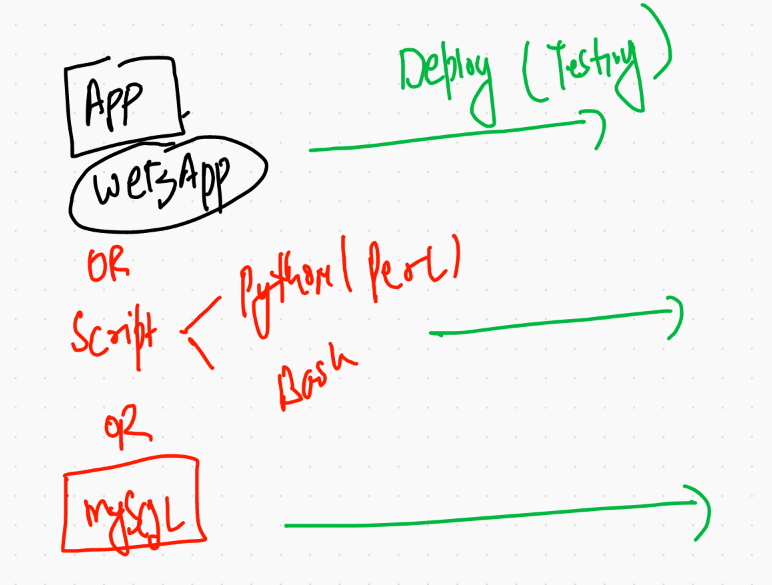

## problems 

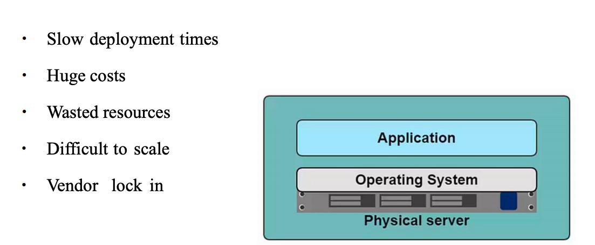

## solution to bare-metal based deployment is Virtualization 

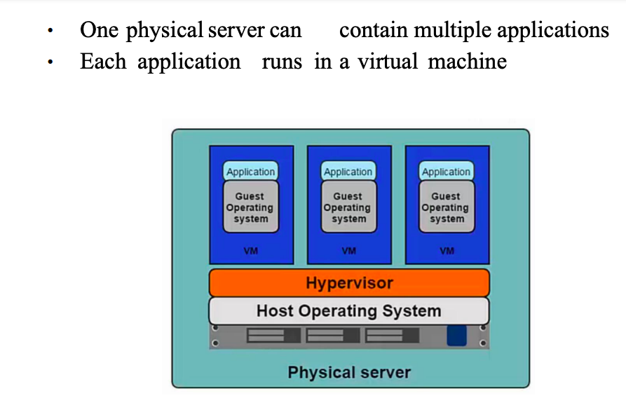

##  problem with VM & Baremetal with respect to OS 

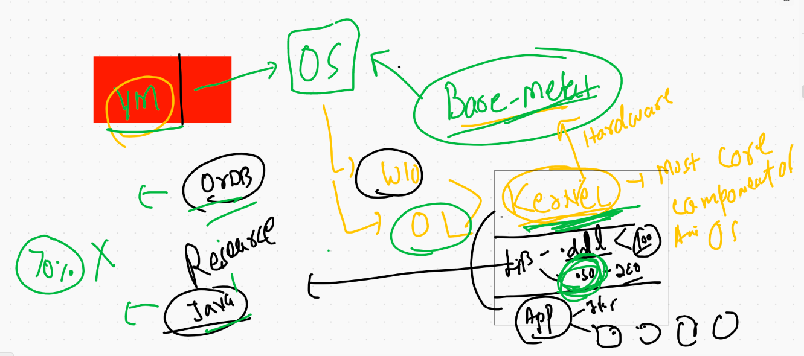

# Introduction to containers 

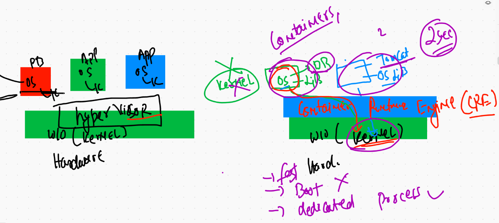

## hypervisor vs CRE 

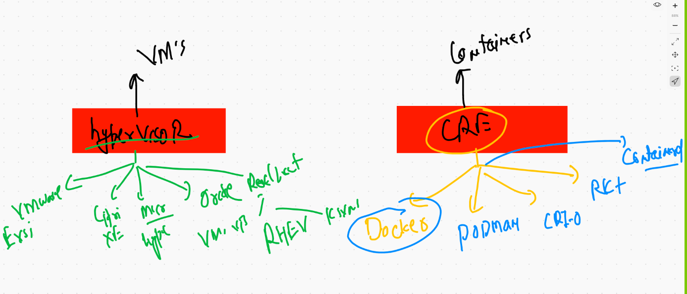

## Docker with Kernel 

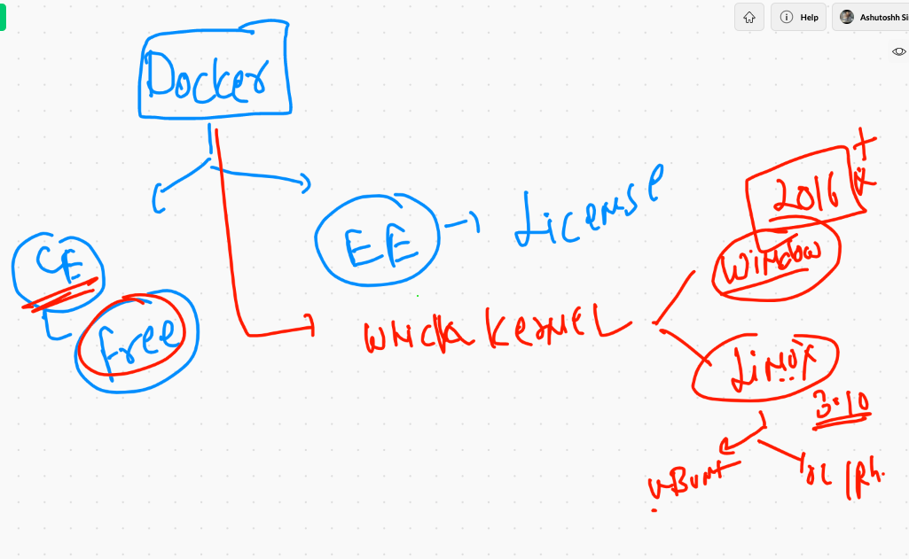

## Docker installation in Windows 10 & mac using Docker desktop 

### docker desktop for MAC

[maclink]('https://hub.docker.com/editions/community/docker-ce-desktop-mac')

### docker desktop for Windows 10 

[w10link]('https://hub.docker.com/editions/community/docker-ce-desktop-windows/')

# Docker Architecutre. 

### checking docker client side software 

```
❯ docker  version
Client: Docker Engine - Community
 Cloud integration: 1.0.7
 Version:           20.10.2
 API version:       1.41
 Go version:        go1.13.15
 Git commit:        2291f61
 Built:             Mon Dec 28 16:12:42 2020
 OS/Arch:           darwin/amd64
 Context:           default
 Experimental:      true


OR 

❯ docker  -v
Docker version 20.10.2, build 2291f61


```


## IF you have Docker desktop and that is running fine you will see this output 

```
❯ docker  version
Client: Docker Engine - Community
 Cloud integration: 1.0.7
 Version:           20.10.2
 API version:       1.41
 Go version:        go1.13.15
 Git commit:        2291f61
 Built:             Mon Dec 28 16:12:42 2020
 OS/Arch:           darwin/amd64
 Context:           default
 Experimental:      true

Server: Docker Engine - Community
 Engine:
  Version:          20.10.2
  API version:      1.41 (minimum version 1.12)
  Go version:       go1.13.15
  Git commit:       8891c58
  Built:            Mon Dec 28 16:15:28 2020
  OS/Arch:          linux/amd64
  Experimental:     false
 containerd:
  Version:          1.4.3
  GitCommit:        269548fa27e0089a8b8278fc4fc781d7f65a939b
 runc:
  Version:          1.0.0-rc92
  GitCommit:        ff819c7e9184c13b7c2607fe6c30ae19403a7aff
 docker-init:
  Version:          0.19.0
  GitCommit:        de40ad0

```

## Now only Installing and starting docker engine on AWS cloud in a linux VM 

### step 1 

```
[root@ip-172-31-86-132 ~]# yum  install docker  -y
Failed to set locale, defaulting to C
Loaded plugins: extras_suggestions, langpacks, priorities, update-motd
amzn2-core                                                                                | 3.7 kB  00:00:00     
Resolving Dependencies
--> Running transaction check
---> Package docker.x86_64 0:19.03.13ce-1.amzn2 will be installed
--> Processing Dependency: runc >= 1.0.0 for package: docker-19.03.13ce-1.amzn2.x86_64
--> Processing Dependency: containerd >= 1.3.2 for package: docker-19.03.13ce-1.amzn2.x86_64
--> Processing Dependency: pigz for package: docker-19.03.13ce-1.amzn2.x86_64
--> Processing Dependency: libcgroup for package: docker-19.03.13ce-1.amzn2.x86_64
--> Running transaction check
---> Package containerd.x86_64 0:1.4.1-2.amzn2 will be installed
---> Package libcgroup.x86_64 0:0.41-21.amzn2 will be installed
---> Package pigz.x86_64 0:2.3.4-1.amzn2.0.1 will be installed
---> Package runc.x86_64 0:1.0.0-0.1.20200826.gitff819c7.amzn2 will be installed
--> Finished Dependency Resolution


```

### step 2  COnfigure Docker engine to accept remote client request 

```
[root@ip-172-31-86-132 ~]# cd  /etc/sysconfig/
[root@ip-172-31-86-132 sysconfig]# ls
acpid       console         grub        man-db           nfs            rpcbind    sshd
atd         cpupower        i18n        modules          raid-check     rsyncd     sysstat
authconfig  crond           init        netconsole       rdisc          rsyslog    sysstat.ioconf
chronyd     docker          irqbalance  network          readonly-root  run-parts
clock       docker-storage  keyboard    network-scripts  rpc-rquotad    selinux
[root@ip-172-31-86-132 sysconfig]# vim docker
[root@ip-172-31-86-132 sysconfig]# cat  docker
# The max number of open files for the daemon itself, and all
# running containers.  The default value of 1048576 mirrors the value
# used by the systemd service unit.
DAEMON_MAXFILES=1048576

# Additional startup options for the Docker daemon, for example:
# OPTIONS="--ip-forward=true --iptables=true"
# By default we limit the number of open files per container
OPTIONS="--default-ulimit nofile=1024:4096 -H tcp://0.0.0.0:2375"

# How many seconds the sysvinit script waits for the pidfile to appear
# when starting the daemon.
DAEMON_PIDFILE_TIMEOUT=10
[root@ip-172-31-86-132 sysconfig]# systemctl daemon-reload 
[root@ip-172-31-86-132 sysconfig]# systemctl restart docker 
[root@ip-172-31-86-132 sysconfig]# systemctl enable  docker 
Created symlink from /etc/systemd/system/multi-user.target.wants/docker.service to /usr/lib/systemd/system/docker.service.


```

## ANy OS client can connect to remote Docker engine using context logic

```
9975  docker  context  create  training   --docker  host="tcp://54.204.22.14:2375"
 9976  history
 9977  docker  context  ls
 9978  docker  context  use  training 
 9979  docker  context  ls
 9980  history
 9981  docker  context  ls

```

## ANother method for connecting to remote DOcker engine 

### For windows powershell 

```
 $env:DOCKER_HOST="tcp://54.204.22.14:2375"
```

### For linux / mac client 

```
export DOCKER_HOST="tcp://54.204.22.14:2375"
```

## Container creation process 

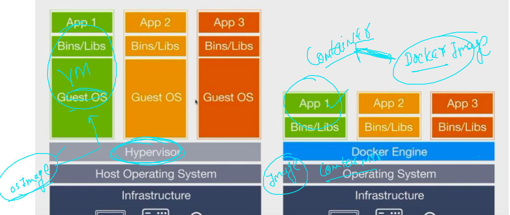

## Docker images from. Docker hub 

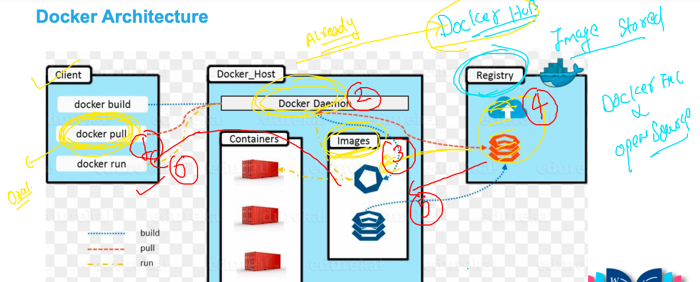

### PUlling first docker image from Docker HUb 

```
❯ docker  images
REPOSITORY   TAG       IMAGE ID   CREATED   SIZE
❯ docker  pull  oraclelinux:8.3
8.3: Pulling from library/oraclelinux
230d257ffbc9: Pull complete 
Digest: sha256:7640e89a4a47b71132d66546acf73741d21353149a5c523c6cd4e84fb860d30a
Status: Downloaded newer image for oraclelinux:8.3
docker.io/library/oraclelinux:8.3
❯ 
❯ docker  images
REPOSITORY    TAG       IMAGE ID       CREATED       SIZE
oraclelinux   8.3       d8ccb1b24024   4 weeks ago   223MB


```

## some more images

```
10005  docker  pull  busybox  
10006  docker  pull  alpine 
10007  docker  pull  mysql 
❯ docker  images
REPOSITORY    TAG       IMAGE ID       CREATED       SIZE
mysql         latest    8457e9155715   9 days ago    546MB
busybox       latest    491198851f0c   2 weeks ago   1.23MB
alpine        latest    28f6e2705743   2 weeks ago   5.61MB
oraclelinux   8.3       d8ccb1b24024   4 weeks ago   223MB
❯ 

```

## SOme internal about docker ENgine side 

```
[root@ip-172-31-86-132 sysconfig]# cd  /var/lib/docker/
[root@ip-172-31-86-132 docker]# ls
builder  buildkit  containers  image  network  overlay2  plugins  runtimes  swarm  tmp  trust  volumes
[root@ip-172-31-86-132 docker]# cd  image/
[root@ip-172-31-86-132 image]# ls
overlay2
[root@ip-172-31-86-132 image]# cd  overlay2/
[root@ip-172-31-86-132 overlay2]# ls
distribution  imagedb  layerdb  repositories.json
[root@ip-172-31-86-132 overlay2]# cd  imagedb/
[root@ip-172-31-86-132 imagedb]# ls
content  metadata
[root@ip-172-31-86-132 imagedb]# cd content/
[root@ip-172-31-86-132 content]# ls
sha256
[root@ip-172-31-86-132 content]# cd sha256/
[root@ip-172-31-86-132 sha256]# ls
28f6e27057430ed2a40dbdd50d2736a3f0a295924016e294938110eeb8439818
491198851f0ccdd0882cb9323f3856043d4e4c65b773e8eac3e0f6bc979a2ae7
8457e9155715d4e1c80c9e048d94c9b47b5b733fa927756280382dd326403644
d8ccb1b2402462bc26cefd51deb14a345c07f350960517b295d14bf69e140724
[root@ip-172-31-86-132 sha256]# docker  images
REPOSITORY          TAG                 IMAGE ID            CREATED             SIZE
mysql               latest              8457e9155715        9 days ago          546MB
busybox             latest              491198851f0c        2 weeks ago         1.23MB
alpine              latest              28f6e2705743        2 weeks ago         5.61MB
oraclelinux         8.3                 d8ccb1b24024        4 weeks ago         223MB

```

## Creating first container with ol:8.3 image 

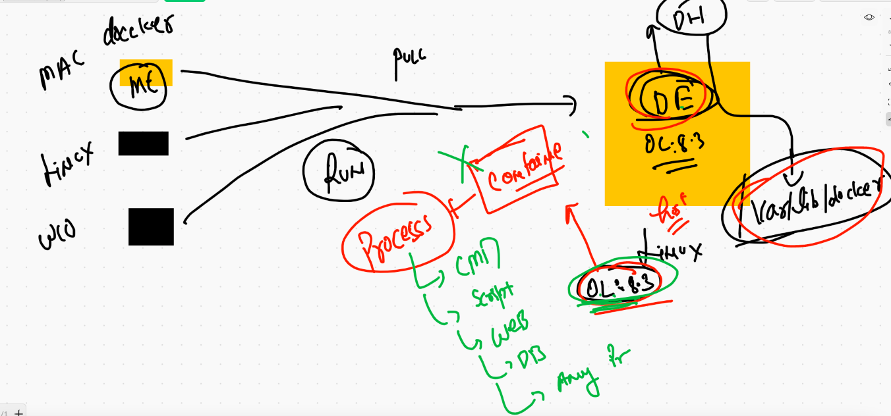


```
 docker  run  --name  ashuc1  oraclelinux:8.3   ping 127.0.0.1
PING 127.0.0.1 (127.0.0.1) 56(84) bytes of data.
64 bytes from 127.0.0.1: icmp_seq=1 ttl=255 time=0.018 ms
64 bytes from 127.0.0.1: icmp_seq=2 ttl=255 time=0.019 ms
64 bytes from 127.0.0.1: icmp_seq=3 ttl=255 time=0.026 ms
64 bytes from 127.0.0.1: icmp_seq=4 ttl=255 time=0.026 ms
64 bytes from 127.0.0.1: icmp_seq=5 ttl=255 time=0.026 ms
64 bytes from 127.0.0.1: icmp_seq=6 ttl=255 time=0.025 ms
64 bytes from 127.0.0.1: icmp_seq=7 ttl=255 time=0.026 ms
64 bytes from 127.0.0.1: icmp_seq=8 ttl=255 time=0.025 ms

```

### Listing all the containers 

```
 docker  ps  -a
CONTAINER ID   IMAGE             COMMAND            CREATED              STATUS                      PORTS     NAMES
a7839bbf1024   oraclelinux:8.3   "ping 127.0.0.1"   10 seconds ago       Up 7 seconds                          sankalita
db0dcef7818f   oraclelinux:8.3   "ping 127.0.0.1"   34 seconds ago       Up 31 seconds                         jerijose
63b5e4dd466a   oraclelinux:8.3   "ping 127.0.0.1"   41 seconds ago       Up 38 seconds                         balaji
fec5cde7e365   oraclelinux:8.3   "ping 127.0.0.1"   45 seconds ago       Exited (0) 24 seconds ago             titu
6a291509d02a   oraclelinux:8.3   "ping 127.0.0.1"   About a minute ago   Up About a minute                     ravi1
6d79538fc44c   oraclelinux:8.3   "hostname"         2 minutes ago        Created                               titukp
0f23b77d2f1a   oraclelinux:8.3   "ping 127.0.0.1"   3 minutes ago        Exited (0) 3 minutes ago              ashuc1

```


## checking all the running containers 

```
❯ docker  ps
CONTAINER ID   IMAGE             COMMAND            CREATED             STATUS             PORTS     NAMES
562546682b6a   oraclelinux:8.3   "ping 127.0.0.1"   About an hour ago   Up About an hour             kiran
7d3d87abab21   oraclelinux:8.3   "ping 127.0.0.1"   About an hour ago   Up About an hour             dharam
3a0fdc24816e   oraclelinux:8.3   "ping 127.0.0.1"   About an hour ago   Up About an hour             AV
e81b0343426c   oraclelinux:8.3   "ping 127.0.0.1"   About an hour ago   Up About an hour             avijit
a7839bbf1024   oraclelinux:8.3   "ping 127.0.0.1"   About an hour ago   Up About an hour             sankalita
db0dcef7818f   oraclelinux:8.3   "ping 127.0.0.1"   About an hour ago   Up About an hour             jerijose
63b5e4dd466a   oraclelinux:8.3   "ping 127.0.0.1"   About an hour ago   Up About an hour             balaji
6a291509d02a   oraclelinux:8.3   "ping 127.0.0.1"   About an hour ago   Up About an hour             ravi1

```

## all type of containers 

```
❯ docker  ps  -a
CONTAINER ID   IMAGE             COMMAND            CREATED             STATUS                         PORTS     NAMES
562546682b6a   oraclelinux:8.3   "ping 127.0.0.1"   About an hour ago   Up About an hour                         kiran
13dbdc82f6d6   oraclelinux:8.3   "date"             About an hour ago   Exited (0) About an hour ago             titu1
7d3d87abab21   oraclelinux:8.3   "ping 127.0.0.1"   About an hour ago   Up About an hour                         dharam
3a0fdc24816e   oraclelinux:8.3   "ping 127.0.0.1"   About an hour ago   Up About an hour                         AV
e81b0343426c   oraclelinux:8.3   "ping 127.0.0.1"   About an hour ago   Up About an hour                         avijit
a7839bbf1024   oraclelinux:8.3   "ping 127.0.0.1"   About an hour ago   Up About an hour                         sankalita
db0dcef7818f   oraclelinux:8.3   "ping 127.0.0.1"   About an hour ago   Up About an hour                         jerijose
63b5e4dd466a   oraclelinux:8.3   "ping 127.0.0.1"   About an hour ago   Up About an hour                         balaji
fec5cde7e365   oraclelinux:8.3   "ping 127.0.0.1"   About an hour ago   Exited (0) About an hour ago             titu
6a291509d02a   oraclelinux:8.3   "ping 127.0.0.1"   About an hour ago   Up About an hour                         ravi1
6d79538fc44c   oraclelinux:8.3   "hostname"         About an hour ago   Created                                  titukp
0f23b77d2f1a   oraclelinux:8.3   "ping 127.0.0.1"   2 hours ago         Exited (0) 2 hours ago                   ashuc1


```

### running a child process in already running container 

```
❯ docker  exec  -it   ashuc1   bash
[root@0f23b77d2f1a /]# uname 
Linux
[root@0f23b77d2f1a /]# uname -r
4.14.219-161.340.amzn2.x86_64
[root@0f23b77d2f1a /]# 
[root@0f23b77d2f1a /]# 
[root@0f23b77d2f1a /]# 
[root@0f23b77d2f1a /]# ls
bin  boot  dev  etc  home  lib  lib64  media  mnt  opt  proc  root  run  sbin  srv  sys  tmp  usr  var
[root@0f23b77d2f1a /]# ip a
1: lo: <LOOPBACK,UP,LOWER_UP> mtu 65536 qdisc noqueue state UNKNOWN group default qlen 1000
    link/loopback 00:00:00:00:00:00 brd 00:00:00:00:00:00
    inet 127.0.0.1/8 scope host lo
       valid_lft forever preferred_lft forever
38: eth0@if39: <BROADCAST,MULTICAST,UP,LOWER_UP> mtu 1500 qdisc noqueue state UP group default 
    link/ether 02:42:ac:11:00:04 brd ff:ff:ff:ff:ff:ff link-netnsid 0
    inet 172.17.0.4/16 brd 172.17.255.255 scope global eth0
       valid_lft forever preferred_lft forever
[root@0f23b77d2f1a /]# 
[root@0f23b77d2f1a /]# ping  gogole.com
PING gogole.com (172.253.63.147) 56(84) bytes of data.
64 bytes from 172.253.63.147 (172.253.63.147): icmp_seq=1 ttl=97 time=0.791 ms
64 bytes from 172.253.63.147 (172.253.63.147): icmp_seq=2 ttl=97 time=0.776 ms
64 bytes from 172.253.63.147 (172.253.63.147): icmp_seq=3 ttl=97 time=0.829 ms
^C
--- gogole.com ping statistics ---
3 packets transmitted, 3 received, 0% packet loss, time 86ms
rtt min/avg/max/mdev = 0.776/0.798/0.829/0.039 ms
[root@0f23b77d2f1a /]# exit
exit

```

### killing all the running containers

```
❯ docker  ps
CONTAINER ID   IMAGE             COMMAND            CREATED             STATUS              PORTS     NAMES
562546682b6a   oraclelinux:8.3   "ping 127.0.0.1"   About an hour ago   Up 14 minutes                 kiran
7d3d87abab21   oraclelinux:8.3   "ping 127.0.0.1"   2 hours ago         Up 16 minutes                 dharam
3a0fdc24816e   oraclelinux:8.3   "ping 127.0.0.1"   2 hours ago         Up 2 hours                    AV
e81b0343426c   oraclelinux:8.3   "ping 127.0.0.1"   2 hours ago         Up 2 hours                    avijit
a7839bbf1024   oraclelinux:8.3   "ping 127.0.0.1"   2 hours ago         Up 14 minutes                 sankalita
db0dcef7818f   oraclelinux:8.3   "ping 127.0.0.1"   2 hours ago         Up 15 minutes                 jerijose
63b5e4dd466a   oraclelinux:8.3   "ping 127.0.0.1"   2 hours ago         Up About a minute             balaji
❯ docker  ps  -q
562546682b6a
7d3d87abab21
3a0fdc24816e
e81b0343426c
a7839bbf1024
db0dcef7818f
63b5e4dd466a
❯ docker kill   $(docker  ps  -q)
562546682b6a
7d3d87abab21
3a0fdc24816e
e81b0343426c
a7839bbf1024
db0dcef7818f
63b5e4dd466a
❯ docker  ps
CONTAINER ID   IMAGE     COMMAND   CREATED   STATUS    PORTS     NAMES
```

## if you want to remove all non running containers 

```
❯ docker rm  $(docker  ps -a  -q)
2e7af96d283b
562546682b6a
13dbdc82f6d6
7d3d87abab21
3a0fdc24816e
e81b0343426c
a7839bbf1024
db0dcef7818f
63b5e4dd466a
fec5cde7e365
6a291509d02a
6d79538fc44c
❯ docker  ps  -a
CONTAINER ID   IMAGE     COMMAND   CREATED   STATUS    PORTS     NAMES


```

### Best practise to create container from any image 

```
❯ docker  run  -it -d   --name ashuc3  oraclelinux:8.3   ping google.com
6e014ca8b9d4a576487881540f24890e47cba213df6ca835ad4eac411f0f4ee0
❯ docker  ps
CONTAINER ID   IMAGE             COMMAND             CREATED         STATUS         PORTS     NAMES
6e014ca8b9d4   oraclelinux:8.3   "ping google.com"   6 seconds ago   Up 4 seconds             ashuc3


```

## Building docker images 

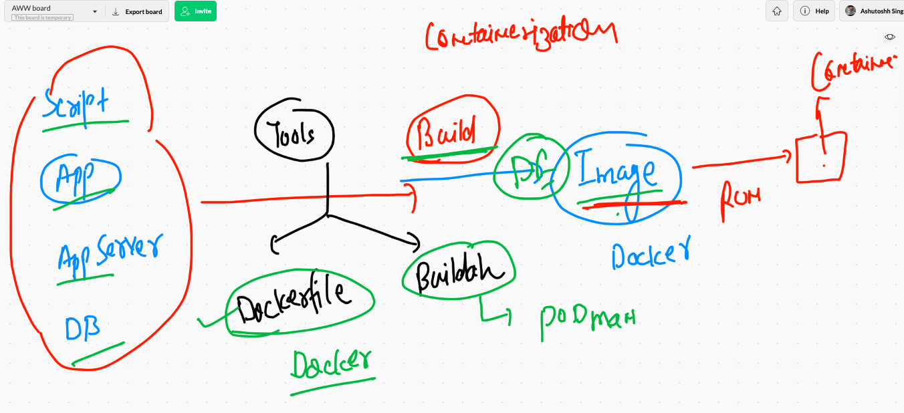

### building python code based docker image

```
 docker   build  -t  ashupython:v001   /Users/fire/Desktop/myimages/pythoncode 
 
```

## more command for build 

```
10085  docker   build  -t  ashupython:v001   /Users/fire/Desktop/myimages/pythoncode 
10086  docker  images
❯ cd  /Users/fire/Desktop/myimages/pythoncode
❯ 
❯ docker   build  -t  ashupython:v002   .
Sending build context to Docker daemon  3.584kB
Step 1/6 : FROM oraclelinux:8.3
 ---> d8ccb1b24024
Step 2/6 : MAINTAINER  ashutoshh@linux.com
 ---> Using cache
 ---> 23bf0d09ef0e
Step 3/6 : RUN  dnf install python3 -y
 ---> Using cache
 ---> 3b95e947d496
Step 4/6 : RUN mkdir  /mycode
 ---> Using cache
 ---> 89022fb72b97
Step 5/6 : COPY  hello.py  /mycode/hello.py
 ---> Using cache
 ---> 17013d1d0768
Step 6/6 : CMD   ["python3" ,"/mycode/hello.py"]
 ---> Using cache
 ---> a60063941b12
Successfully built a60063941b12
Successfully tagged ashupython:v002

```

## Docker image build history 

```
❯ docker  history ashupython:v001
IMAGE          CREATED          CREATED BY                                      SIZE      COMMENT
a60063941b12   36 minutes ago   /bin/sh -c #(nop)  CMD ["python3" "/mycode/h…   0B        
17013d1d0768   36 minutes ago   /bin/sh -c #(nop) COPY file:4b0c3e3a3ef65914…   231B      
89022fb72b97   36 minutes ago   /bin/sh -c mkdir  /mycode                       0B        
3b95e947d496   36 minutes ago   /bin/sh -c dnf install python3 -y               126MB     
23bf0d09ef0e   36 minutes ago   /bin/sh -c #(nop)  MAINTAINER ashutoshh@linu…   0B        
d8ccb1b24024   4 weeks ago      /bin/sh -c #(nop)  CMD ["/bin/bash"]            0B        
<missing>      4 weeks ago      /bin/sh -c #(nop) ADD file:ac3abfcde004b7133…   223MB   

```


## Dump of docker image for info purpose 

```
 docker  inspect  ashupython:v001
[
    {
        "Id": "sha256:a60063941b128bff86b5ef8aa6c14cb36d64f5fd19c0fc7b9902c16c92848215",
        "RepoTags": [
            "ashupython:v001",
            "ashupython:v002"
        ],
        "RepoDigests": [],
        "Parent": "sha256:17013d1d07688eadc0736c41f5bca5493c9653f00c5f8641e51c5126065e03ad",
        "Comment": "",
        "Created": "2021-03-08T10:16:13.185014778Z",
        "Container": "5a6ba4e74f7ff32913e77930638c79061faa894e76769979c2bba8e7aff103f7",
        "ContainerConfig": {
            "Hostname": "5a6ba4e74f7f",
            "Domainname": "",
            "User": "",
            "AttachStdin": false,
            "AttachStdout": false,
            "AttachStderr": false,
            "Tty": false,
            "OpenStdin": false,

```

### creating container from last build image 

```
❯ docker run -it -d  --name ashuc01  ashupython:v001
9993ddf8dd7cc254e2c5f3ee0ea1e0d54e4ccac6b0743417028ce6cb6136f3b2
❯ 
❯ docker  ps
CONTAINER ID   IMAGE             COMMAND                  CREATED             STATUS             PORTS     NAMES
9993ddf8dd7c   ashupython:v001   "python3 /mycode/hel…"   7 seconds ago       Up 5 seconds                 ashuc01
a63469036a15   ravipython:v001   "python3 /mycode/hel…"   31 minutes ago      Up 31 minutes                ravi2
4f8e9d91d26b   jerijosepy:v001   "python3 /mycode/hel…"   37 minutes ago      Up 37 minutes                jerijosepy

```

## check output of python code live using this 

```
docker  logs -f  ashuc01 
```

# webapp to containers 

## some webserver 

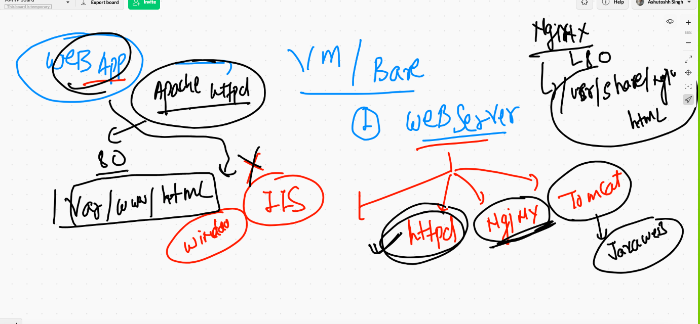

## doing image build 

```
❯ ls
CODE_OF_CONDUCT.md LICENSE            images             styles
Dockerfile         README.md          index.html
❯ docker  build  -t   ashunginx:v1  .
Sending build context to Docker daemon     64kB
Step 1/3 : FROM nginx
latest: Pulling from library/nginx
45b42c59be33: Already exists 
8acc495f1d91: Pull complete 
ec3bd7de90d7: Pull complete 
19e2441aeeab: Pull complete 
f5a38c5f8d4e: Pull complete 
83500d851118: Pull complete 
Digest: sha256:f3693fe50d5b1df1ecd315d54813a77afd56b0245a404055a946574deb6b34fc
Status: Downloaded newer image for nginx:latest
 ---> 35c43ace9216
Step 2/3 : MAINTAINER  ashutoshh@linux.com
 ---> Running in 4642747ad9c1
Removing intermediate container 4642747ad9c1
 ---> 3fe672cf5eed
Step 3/3 : COPY .  /usr/share/nginx/html/
 ---> 6d66360b4fef
Successfully built 6d66360b4fef
Successfully tagged ashunginx:v1

```


## creating container out of build 

```
10124  docker  run -itd  --name myashuc1  -p 1122:80   ashunginx:v1 
10125  docker  ps
❯ docker  ps
CONTAINER ID   IMAGE            COMMAND                  CREATED              STATUS              PORTS                           NAMES
65d3ab5e481c   titobeg:v1       "/docker-entrypoint.…"   About a minute ago   Up About a minute   0.0.0.0:32356->80/tcp           titubegin1
ded55ffca48a   sankalita        "/docker-entrypoint.…"   About a minute ago   Up About a minute   80/tcp, 0.0.0.0:3333->333/tcp   sankalita
23139c5762fa   ravinginx:v001   "/docker-entrypoint.…"   About a minute ago   Up About a minute   0.0.0.0:5999->80/tcp            ravi5
f597186b7c02   ashunginx:v1     "/docker-entrypoint.…"   2 minutes ago        Up 2 minutes        0.0.0.0:1122->80/tcp            myashuc1
1ac0cff1baa6   titobeg:v1       "/docker-entrypoint.…"   2 minut

```


