# FOr Docker only 
## volume & compose need to discusss


## Docker based application lifecycle 


## COntainer orchestration using Docker compose 

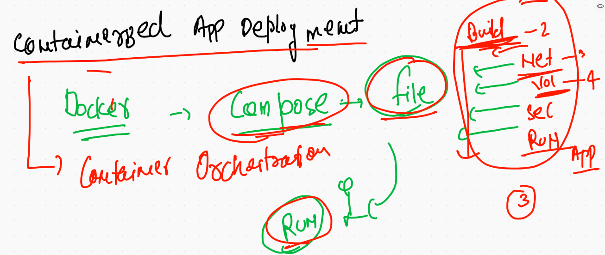

## Docker compose works and file version 

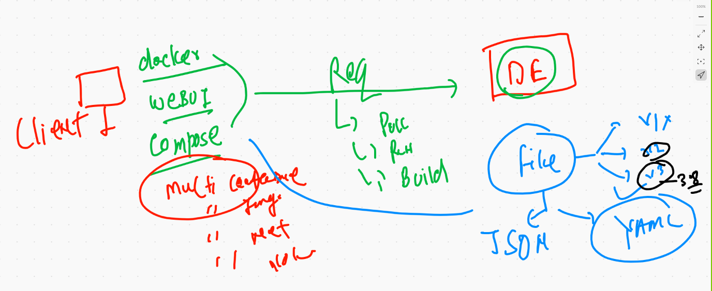

## COmpose installation 

[docker docs](https://docs.docker.com/compose/install/)

## Compose file format 

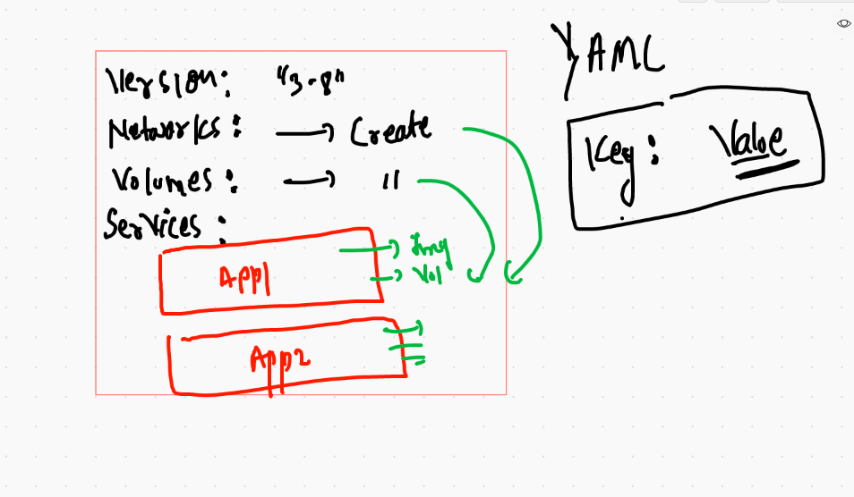

## Example 1

```
10216  cd ashuexample1
10217  ls
10218  docker-compose up  -d
10219  docker-compose ps
10220  docker-compose kill 
10221  docker-compose   ps
10222  docker-compose   start
10223  docker-compose   ps
10224  docker-compose   logs 

```

## to clean up all things 

```
❯ docker-compose down
Stopping ashuc1 ... done
Removing ashuc1 ... done
Removing network ashuexample1_default

```

### example 2

```
❯ cd ashujavawebapp

░▒▓ ~/Desktop/myimages/ashujavawebapp  master !1 ?1 ···························································· 11:33:43 AM ▓▒░─╮
❯                                                                                                                                  ─╯
❯ ls
Dockerfile         README.md          docker-compose.yml myapp
❯ docker-compose up -d
Creating network "ashujavawebapp_default" with the default driver
Creating ashuccc1 ... done
Creating ashucc11 ... done
❯ docker-compose  ps
  Name         Command       State           Ports         
-----------------------------------------------------------
ashucc11   catalina.sh run   Up      0.0.0.0:1133->8080/tcp
ashuccc1   ping 127.0.0.1    Up                            
❯ docker-compose kill  ashuapp22
Killing ashuccc1 ... done
❯ docker-compose ps
  Name         Command        State             Ports         
--------------------------------------------------------------
ashucc11   catalina.sh run   Up         0.0.0.0:1133->8080/tcp
ashuccc1   ping 127.0.0.1    Exit 137                         
❯ docker-compose  start
Starting ashujavaapp ... done
Starting ashuapp22   ... done
❯ docker-compose ps
  Name         Command       State           Ports         
-----------------------------------------------------------
ashucc11   catalina.sh run   Up      0.0.0.0:1133->8080/tcp
ashuccc1   ping 127.0.0.1    Up                            
❯ docker-compose kill
Killing ashucc11 ... done
Killing ashuccc1 ... done
❯ docker-compose rm
Going to remove ashucc11, ashuccc1
Are you sure? [yN] y
Removing ashucc11 ... done
Removing ashuccc1 ... done
❯ docker-compose down
Removing network ashujavawebapp_default

```

## Just docker is not good for production grade app deployment 

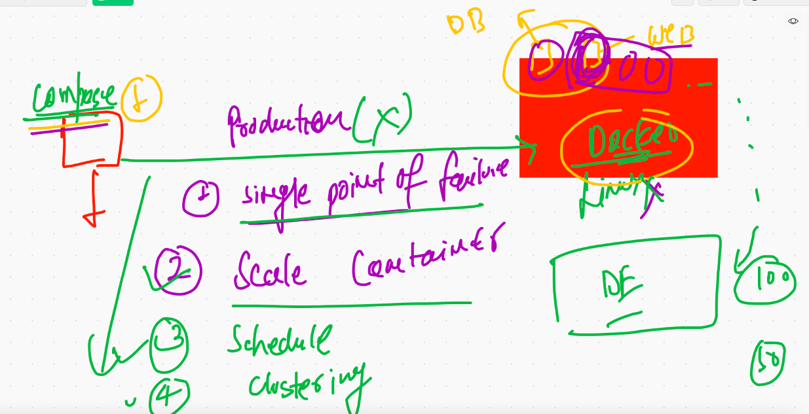

## CRE clustering and container orchestration 

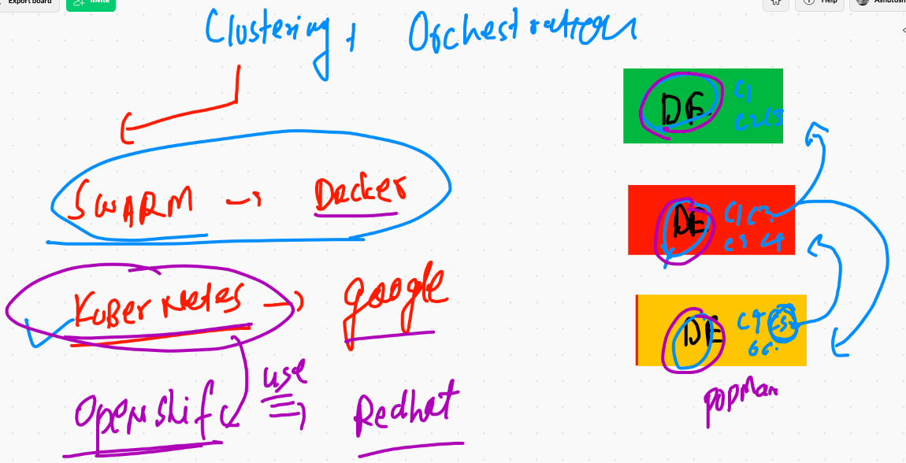


## Info about Kubernetes 

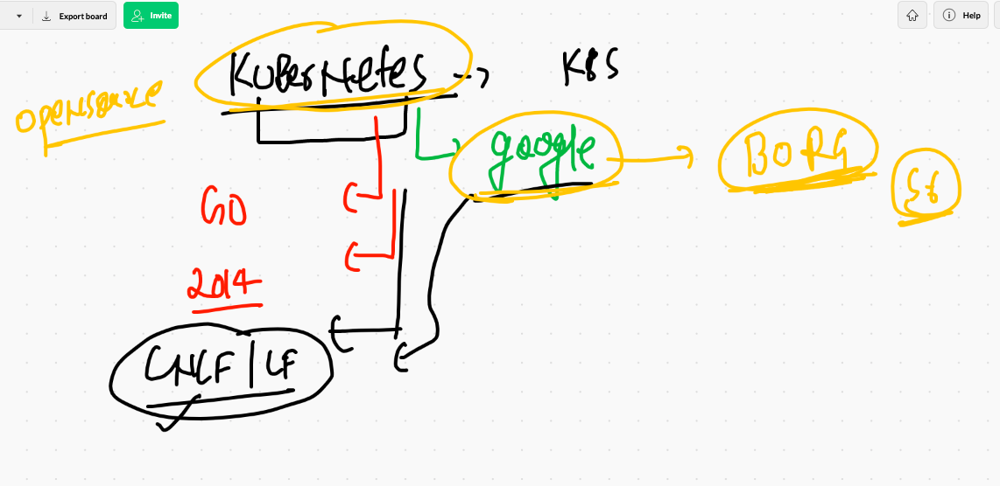


# Kubernetes architecture  

## Level 1 

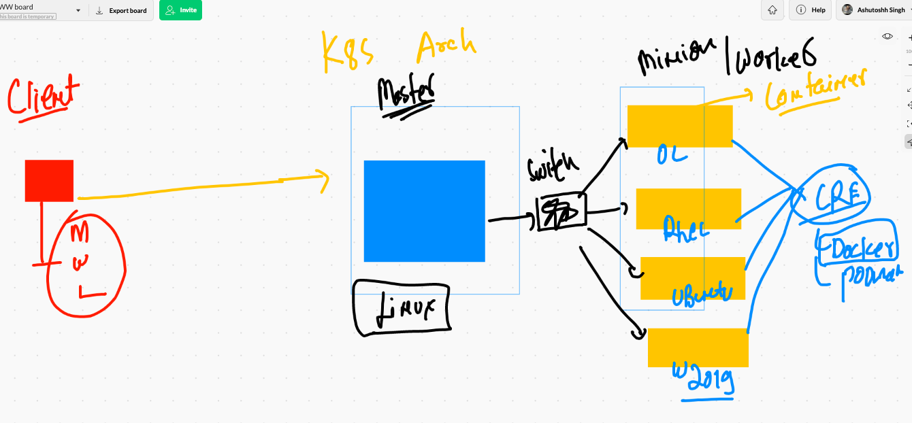

## level 2 -- kube-apiserver

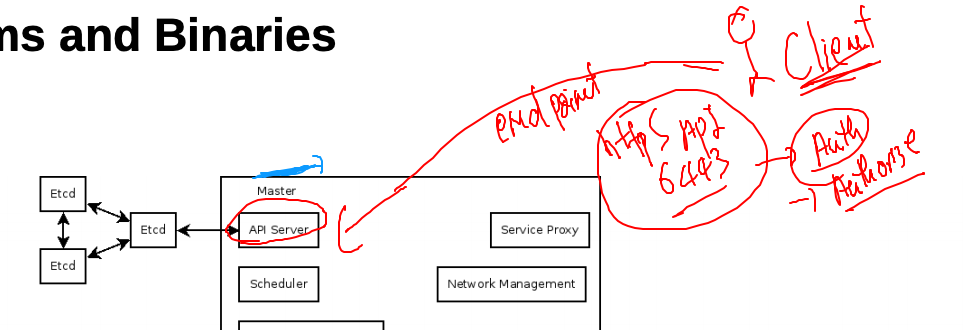

## Level 3 -- kube-schedular 

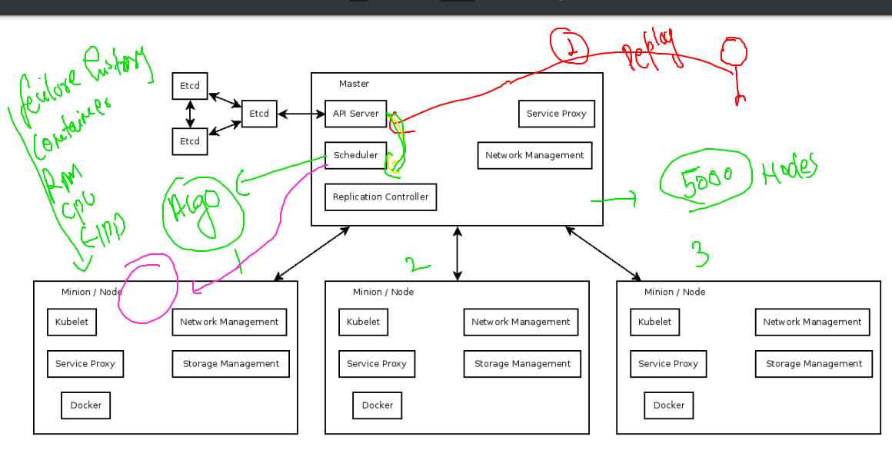

## level 4 -- replication controller 


## Level 5 - ECTD 

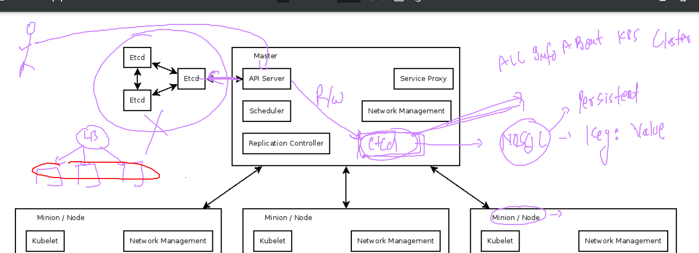

## Minion Side there will be a distributed bridge for container ips 

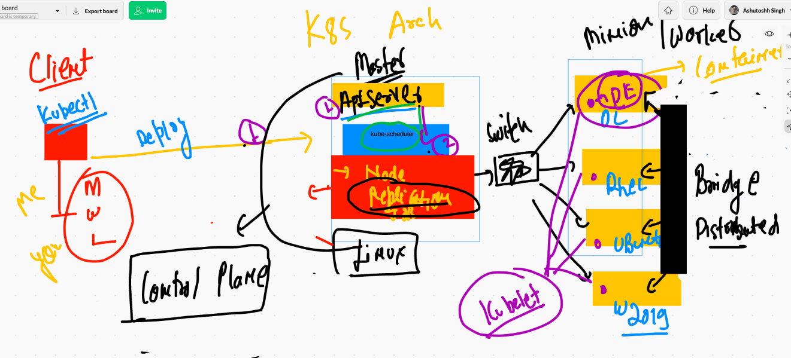

## kube proxy 

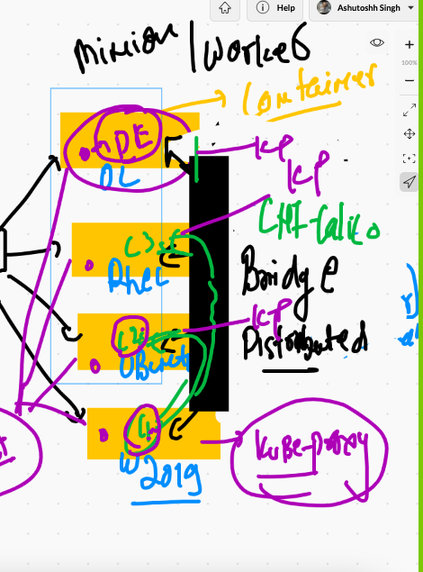

## COntainer networking strategy


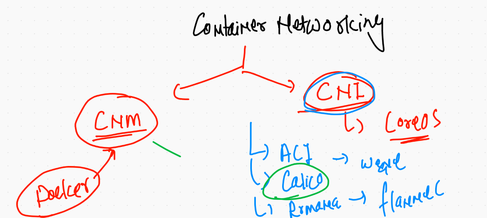


