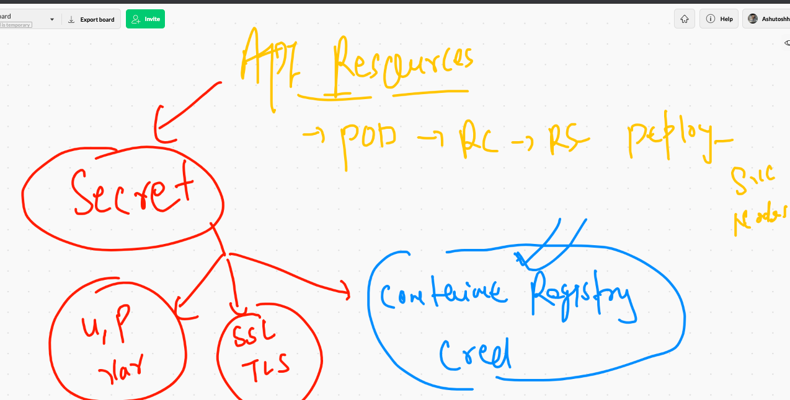
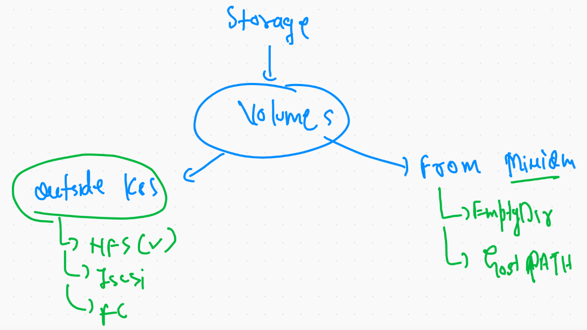
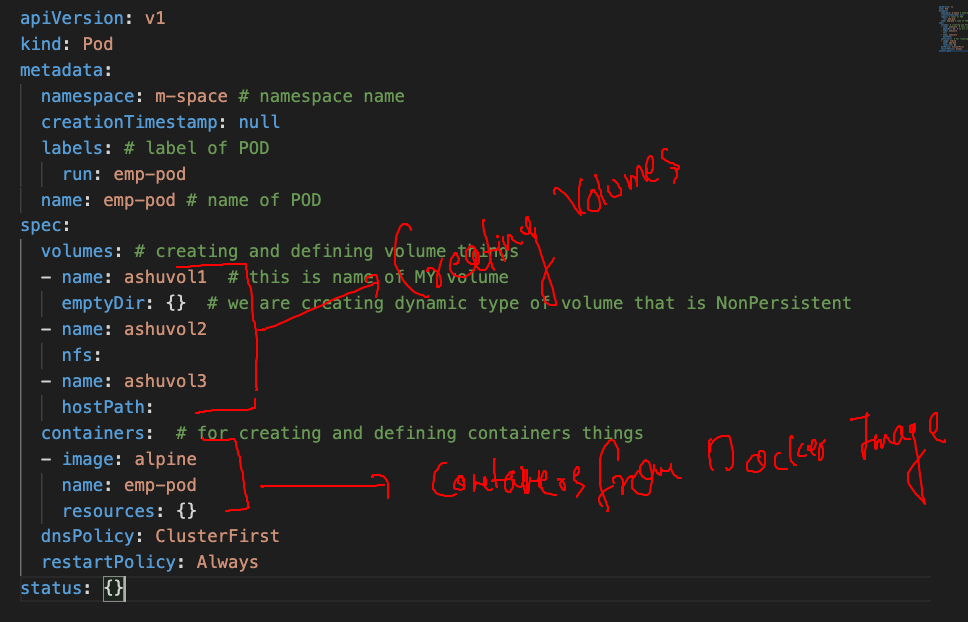
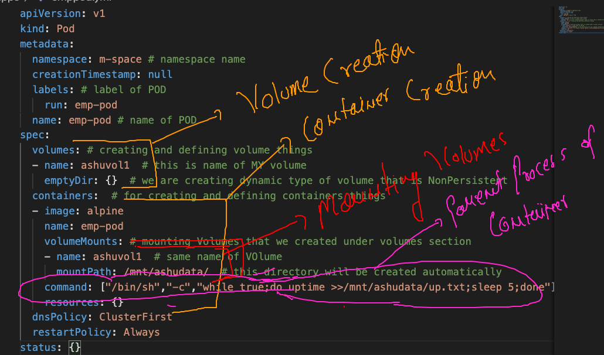
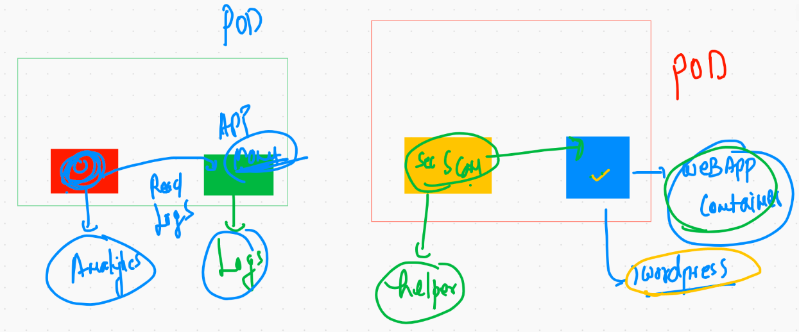
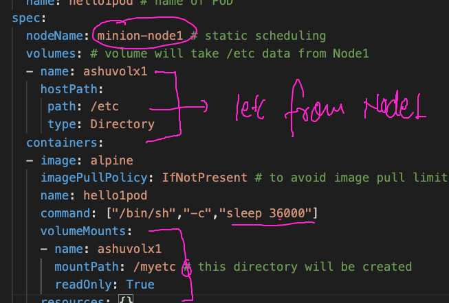
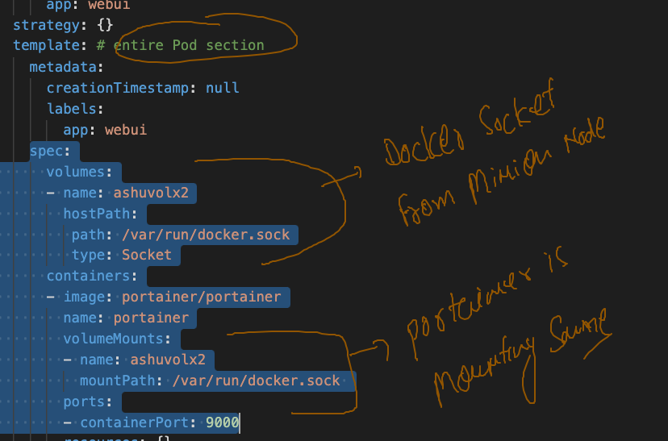

# Welcome to Last day of K8s training 

## Application deployment model flow 


## application deployment model


# Deployment best practise again 

## Building version 1 of web app from Github code 

```
❯ docker  build  -t  dockerashu/mywebapp:v1  https://github.com/redashu/mywebapp.git#main
Sending build context to Docker daemon  292.9kB
Step 1/7 : FROM oraclelinux:8.3
 ---> d8ccb1b24024
Step 2/7 : MAINTAINER ashutoshh@linux.com
 ---> Using cache
 ---> d7e62726d788
Step 3/7 : RUN dnf install httpd -y
 ---> Using cache
 ---> 7a21331ce6f0
Step 4/7 : COPY index.html /var/www/html/index.html
 ---> 1b04876e72e0
Step 5/7 : COPY friends.png /var/www/html/friends.png
 ---> d192d9e7d29e
Step 6/7 : EXPOSE 80
 ---> Running in 48561d1de7fd
Removing intermediate container 48561d1de7fd
 ---> c8e448438944
Step 7/7 : ENTRYPOINT httpd -DFOREGROUND
 ---> Running in b5196bbf7d48
Removing intermediate container b5196bbf7d48
 ---> 9ffc6de873aa
Successfully built 9ffc6de873aa
Successfully tagged dockerashu/mywebapp:v1


```

## Cleaning my namespace before new deployment 

```
❯ kubectl  delete all --all -n m-space
pod "ashudep1-5bd796f4d8-sbxjs" deleted
pod "ashudep1-5bd796f4d8-t4xps" deleted
pod "ashudep1-5bd796f4d8-vfv2t" deleted
pod "dharam11-78cb4d9bcb-ftrlg" deleted
service "ashusvc1" deleted
service "dharamsvc123" deleted
deployment.apps "ashudep1" deleted
deployment.apps "dharam11" deleted
replicaset.apps "ashudep1-5bd796f4d8" deleted
replicaset.apps "ashudep1-6fc5566fc5" deleted

```


## deployment of application from Docker hub 

```
❯ ls
aa.txt           ashurc1.yaml     dockerhubdep.yml multiapp         mypoddd.yaml     pod1.yaml
al.yml           autopod.yaml     hello.yaml       mydep.yml        nodeport.yaml
❯ kubectl  apply  -f  dockerhubdep.yml
deployment.apps/ashuwebapp created
❯ 
❯ 
❯ kubectl   get  deploy  -n m-space
NAME         READY   UP-TO-DATE   AVAILABLE   AGE
ashuwebapp   1/1     1            1           16s
❯ kubectl   get  rs  -n m-space
NAME                    DESIRED   CURRENT   READY   AGE
ashuwebapp-5fd4f7dd5c   1         1         1       22s
❯ kubectl   get pod  -n m-space
NAME                          READY   STATUS    RESTARTS   AGE
ashuwebapp-5fd4f7dd5c-lns7s   1/1     Running   0          28s


```

### create service 

```

10032  docker  login  -u dockerashu 
10033  docker push dockerashu/mywebapp:v1 
10034  docker  tag  dockerashu/mywebapp:v1  oracleteam.azurecr.io/mywebapp:v1  
10035  docker login  oracleteam.azurecr.io  -u  oracleteam 
10036  docker push oracleteam.azurecr.io/mywebapp:v1 
10037  history
10038  cd Desktop/oraclemarch82021/k8sapps
10039  ls
10040  kubectl  create  deployment   ashuwebapp   --image= dockerashu/mywebapp:v1  --dry-run=client -o yaml 
10041  kubectl  create  deployment   ashuwebapp   --image=dockerashu/mywebapp:v1  --dry-run=client -o yaml 
10042  history
10043  kubectl  create  deployment   ashuwebapp   --image=dockerashu/mywebapp:v1  --dry-run=client -o yaml  >dockerhubdep.yml
10044  kubectl get  ns
10045  kubectl  delete all --all -n m-space 
10046  kubectl  get  pod,svc  -n  m-space 
10047  history
10048  ls
10049  kubectl  apply  -f  dockerhubdep.yml  
10050  kubectl   get  deploy  -n m-space 
10051  kubectl   get  rs  -n m-space 
10052  kubectl   get pod  -n m-space 
10053  kubectl  get  ns
10054  history   |   grep -i curr
10055  kubectl  get  deploy 
10056  kubectl  get  rs
10057  kubectl  get  pod
10058  kubectl  get  deploy,rs,pod 
10059  kubectl  get  deploy,rs,pod  -n m-space 
10060  history
10061  kubectl   get  deploy  
10062  kubectl   get  deploy   -n m-space 
❯ 
❯ kubectl  get  deploy
NAME         READY   UP-TO-DATE   AVAILABLE   AGE
ashuwebapp   1/1     1            1           7m13s
❯ kubectl  get  deploy  -n m-space
NAME         READY   UP-TO-DATE   AVAILABLE   AGE
ashuwebapp   1/1     1            1           7m23s
❯ 
❯ 
❯ kubectl  expose  deployment  ashuwebapp  --type NodePort --port 1234 --target-port 80  --name mysvc1 -n m-space
service/mysvc1 exposed
❯ kubectl  get  svc -n m-space
NAME     TYPE       CLUSTER-IP      EXTERNAL-IP   PORT(S)          AGE
mysvc1   NodePort   10.98.180.212   <none>        1234:31396/TCP   38s


```

## scaling pods using deployment 

```
❯ kubectl  get   all  -n m-space
NAME                              READY   STATUS    RESTARTS   AGE
pod/ashuwebapp-5fd4f7dd5c-lns7s   1/1     Running   0          45m

NAME             TYPE       CLUSTER-IP      EXTERNAL-IP   PORT(S)          AGE
service/mysvc1   NodePort   10.98.180.212   <none>        1234:31396/TCP   38m

NAME                         READY   UP-TO-DATE   AVAILABLE   AGE
deployment.apps/ashuwebapp   1/1     1            1           46m

NAME                                    DESIRED   CURRENT   READY   AGE
replicaset.apps/ashuwebapp-5fd4f7dd5c   1         1         1       46m
❯ kubectl  get   po  -n m-space
NAME                          READY   STATUS    RESTARTS   AGE
ashuwebapp-5fd4f7dd5c-lns7s   1/1     Running   0          47m
❯ kubectl scale  deploy ashuwebapp --replicas=3  -n m-space
deployment.apps/ashuwebapp scaled
❯ 
❯ kubectl  get   po  -n m-space
NAME                          READY   STATUS    RESTARTS   AGE
ashuwebapp-5fd4f7dd5c-6v7hk   1/1     Running   0          3s
ashuwebapp-5fd4f7dd5c-jxmwb   1/1     Running   0          3s
ashuwebapp-5fd4f7dd5c-lns7s   1/1     Running   0          47m

```

## End user respected deployment 


## rebuild and update

```
10090  kubectl autoscale deployment ashuwebapp  --min=3 --max=50  --cpu-percent=70 -n m-space 
10091  kubectl get deploy -n m-space 
10092  kubectl get svc  -n m-space 
10093  kubectl expose deployment ashuwebapp  --type LoadBalancer --port 1234 --target-port 80 --name lbsvc1   -n m-space 
10094  kubectl get svc  -n m-space 
10095  history
10096  docker push dockerashu/mywebapp:v2
10097  history
10098  kubectl   describe  deploy  ashuwebapp  -n m-space 
10099  kubectl  set image  deployment  ashuwebapp  mywebapp=dockerashu/mywebapp:v2  -n m-space 
10100  history
10101  kubectl   describe  deploy  ashuwebapp  -n m-space 
10102  history
10103  kubectl  rollout history  deployment ashuwebapp  -n m-space  
10104  kubectl   describe  deploy  ashuwebapp  -n m-space 

```

## TO deploy application from Private docker registry 

### ACR image to deploy in k8s 

```
❯ kubectl  create  deployment  dd1  --image=oracleteam.azurecr.io/mywebapp:v1  --dry-run=client -o yaml >secdep.yml
❯ 
❯ kubectl  apply -f  secdep.yml -n m-space
deployment.apps/dd1 created
❯ 
❯ kubectl  get deploy  -n m-space
NAME   READY   UP-TO-DATE   AVAILABLE   AGE
dd1    0/1     1            0           12s
❯ kubectl  get po  -n m-space
NAME                   READY   STATUS             RESTARTS   AGE
dd1-6ccd64c55b-vk462   0/1     ImagePullBackOff   0          20s


```

## Welcome to Secret 



## Introducing image secret 

```
10114  kubectl  create  secret  docker-registry  myimgsec  --docker-server=oracleteam.azurecr.io  --docker-username=oracleteam --docker-password=BlgxQT1K9AFB+wx3/KowWZrMVLFaQI5d  -n m-space  
❯ 
❯ kubectl  get  secret  -n m-space
NAME                  TYPE                                  DATA   AGE
default-token-6mc7w   kubernetes.io/service-account-token   3      22h
myimgsec              kubernetes.io/dockerconfigjson        1      25s

```


# Storage in k8s 


## Pod can store its data in volumes 
### volumes cat take storge from MInions or outside k8s cluster 



### VOlume creationg in POD file



### POd with VOlume examples 



```
❯ kubectl  get  po -n m-space
NAME      READY   STATUS    RESTARTS   AGE
emp-pod   1/1     Running   0          2m13s
❯ 
❯ 
❯ kubectl exec -it  emp-pod  -n m-space  -- sh
/ # 
/ # cd  /mnt/
/mnt # ls
ashudata
/mnt # cd ashudata/
/mnt/ashudata # ls
up.txt
/mnt/ashudata # cat  up.txt 
 09:20:00 up  5:09,  load average: 0.14, 0.12, 0.09
 09:20:05 up  5:09,  load average: 0.13, 0.11, 0.09
 09:20:10 up  5:09,  load average: 0.12, 0.11, 0.09
 09:20:15 up  5:09,  load average: 0.11, 0.11, 0.09
 09:20:20 up  5:09,  load average: 0.18, 0.12, 0.09
 09:20:25 up  5:09,  load average: 0.1
 
```

## Multi container purpose inside POD 



## Multi container pod implementation 

```
❯ kubectl  get  po -n m-space
NAME      READY   STATUS    RESTARTS   AGE
emp-pod   2/2     Running   0          2m7s
❯ 

====

❯  kubectl  describe pod  emp-pod  -n m-space
Name:         emp-pod
Namespace:    m-space
Priority:     0
Node:         minion-node2/172.31.92.33
Start Time:   Fri, 12 Mar 2021 15:10:37 +0530
Labels:       run=emp-pod
Annotations:  cni.projectcalico.org/podIP: 192.168.100.5/32
              cni.projectcalico.org/podIPs: 192.168.100.5/32
Status:       Running
IP:           192.168.100.5
IPs:
  IP:  192.168.100.5
Containers:
  ashuwebc1:
    Container ID:   docker://1455d943631422e85c30fc31b1ad362093bfea93251684c8e7680253ccb1ff75
    Image:          nginx
    Image ID:       docker-pullable://nginx@sha256:46944145c5a2fe27ffd92c42a12be9e245681b7fc9d84a28528bc8ec6ce4d5b6
    Port:           <none>
    Host Port:      <none>
    State:          Running
      Started:      Fri, 12 Mar 2021 15:10:39 +0530
    Ready:          True
    Restart Count:  0
    Environment:    <none>
    Mounts:
      /usr/share/nginx/html/ from ashuvol1 (ro)
      /var/run/secrets/kubernetes.io/serviceaccount from default-token-6mc7w (ro)
  emp-pod:
    Container ID:  docker://7c96d9902e8a2c3cc8751ce58a35b4d732aac3841f9e8a1bc88de08e18bb758a
    Image:         alpine
    Image ID:      docker-pullable://alpine@sha256:a75afd8b57e7f34e4dad8d65e2c7ba2e1975c795ce1ee22fa34f8cf46f96a3be
    Port:          <none>
    Host Port:     <none>
    Command:
      /bin/sh
      -c
      while true;do uptime >>/mnt/ashudata/up.txt;sleep 5;done
    State:          Running


```

## Exposing POD to create service 

```
❯ kubectl expose  pod  emp-pod  --type NodePort --port 1234 --target-port 80 --name x1 -n m-space
service/x1 exposed
❯ kubectl  get  svc -n m-space
NAME   TYPE       CLUSTER-IP      EXTERNAL-IP   PORT(S)          AGE
x1     NodePort   10.105.137.89   <none>        1234:30716/TCP   23s

```

### More to explore 

```
❯ kubectl  replace -f  emppod.yml --force
pod "emp-pod" deleted
pod/emp-pod replaced
❯ kubectl  get  po -n m-space
NAME      READY   STATUS    RESTARTS   AGE
emp-pod   2/2     Running   0          13s
❯ kubectl  get  svc -n m-space
NAME   TYPE       CLUSTER-IP      EXTERNAL-IP   PORT(S)          AGE
x1     NodePort   10.105.137.89   <none>        1234:30716/TCP   10m
❯ kubectl   exec -it  emp-pod -c emp-pod      -n m-space  -- sh
/ # 
/ # 
/ # cd  /mnt/ashudata/
/mnt/ashudata # ls
up.txt
/mnt/ashudata # cat /etc/os-release 
NAME="Alpine Linux"
ID=alpine
VERSION_ID=3.13.2
PRETTY_NAME="Alpine Linux v3.13"
HOME_URL="https://alpinelinux.org/"
BUG_REPORT_URL="https://bugs.alpinelinux.org/"
/mnt/ashudata # 
❯ kubectl   exec -it  emp-pod -c ashuwebc1  -n m-space  -- bash
root@emp-pod:/# cat /etc/os-release 
PRETTY_NAME="Debian GNU/Linux 10 (buster)"
NAME="Debian GNU/Linux"
VERSION_ID="10"
VERSION="10 (buster)"
VERSION_CODENAME=buster
ID=debian
HOME_URL="https://www.debian.org/"
SUPPORT_URL="https://www.debian.org/support"
BUG_REPORT_URL="https://bugs.debian.org/"
root@emp-pod:/# cd /usr/share/nginx/html/
root@emp-pod:/usr/share/nginx/html# ls
up.txt
root@emp-pod:/usr/share/nginx/html# 

```

## Hostpath volume type 




```
❯ kubectl apply -f  hostpath1.yml
pod/hello1pod created
❯ kubectl  get  po -n m-space
NAME        READY   STATUS    RESTARTS   AGE
hello1pod   1/1     Running   0          8s
❯ kubectl  exec -it hello1pod  -n m-space -- sh
/ # cd  /myetc/
/myetc # ls
DIR_COLORS               default                  issue.net                passwd-                  services
DIR_COLORS.256color      depmod.d                 krb5.conf                pkcs11                   sestatus.conf
DIR_COLORS.lightbgcolor  dhcp                     krb5.conf.d              pki                      setuptool.d
GREP_COLORS              docker                   kubernetes               plymouth                 shadow
GeoIP.conf               docker-runtimes.d        ld.so.cache              pm                       shadow-
GeoIP.conf.default       dracut.conf              ld.so.conf               popt.d                   shells
NetworkManager           dracut.conf.d            ld.so.conf.d             postfix                  skel
X11                      e2fsck

```

## volume in Deployment 




## DB deployment in k8s 

### creating a secret to store db credential 

```
❯ kubectl  create  secret
Create a secret using specified subcommand.

Available Commands:
  docker-registry Create a secret for use with a Docker registry
  generic         Create a secret from a local file, directory or literal value
  tls             Create a TLS secret

Usage:
  kubectl create secret [flags] [options]

Use "kubectl <command> --help" for more information about a given command.
Use "kubectl options" for a list of global command-line options (applies to all commands).
❯ kubectl  create  secret   generic  ashusec1  --from-literal  mydbpass=Oracle098 -n m-space
secret/ashusec1 created


```


