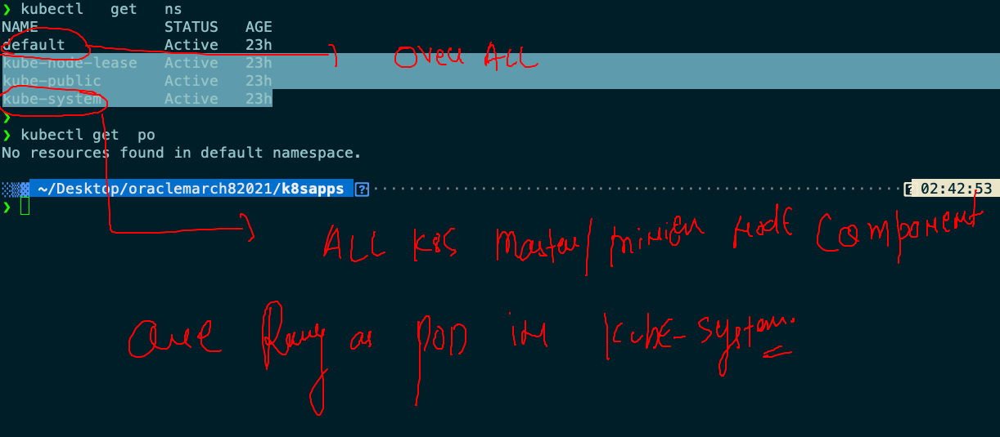
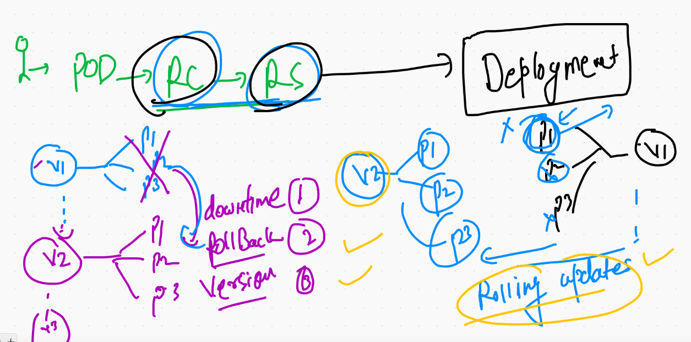
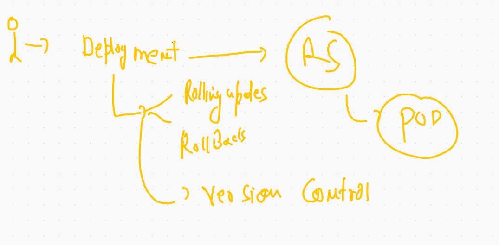

# ON client side of K8s cluster

## you can set admin.conf file persistently 

```
❯ cp  -v  ~/Desktop/admin.conf  ~/.kube/config
/Users/fire/Desktop/admin.conf -> /Users/fire/.kube/config


```

## checking it 


```
❯ kubectl  get  nodes
NAME           STATUS   ROLES                  AGE   VERSION
master-node    Ready    control-plane,master   18h   v1.20.4
minion-node1   Ready    <none>                 18h   v1.20.4
minion-node2   Ready    <none>                 18h   v1.20.4

```


## Why Pod IP can't be used to access application running in POd 


## more closure look 


### service can't user name/ IP of pod to forward traffic 


# SERVICE IN K8S

## service will connect to APISErver on master node -- etcd -- to find labeled POD 


## service type 


# Nodeport 


===


## Deploy pod with labels 

```
❯ kubectl  apply -f pod1.yaml
pod/ashupod-1 created
❯ kubectl  get  po
NAME        READY   STATUS    RESTARTS   AGE
ashupod-1   1/1     Running   0          5s
❯ kubectl  get  po  --show-labels
NAME        READY   STATUS    RESTARTS   AGE   LABELS
ashupod-1   1/1     Running   0          11s   <none>
❯ kubectl  apply -f pod1.yaml
pod/ashupod-1 configured
❯ kubectl  get  po  --show-labels
NAME        READY   STATUS    RESTARTS   AGE   LABELS
ashupod-1   1/1     Running   0          77s   x=helloashu

```
### creating nodeport service 

```
❯ kubectl  create  service  nodeport  ashusvc1  --tcp  1234:8080 --dry-run=client -o yaml
apiVersion: v1
kind: Service
metadata:
  creationTimestamp: null
  labels:
    app: ashusvc1
  name: ashusvc1
spec:
  ports:
  - name: 1234-8080
    port: 1234
    protocol: TCP
    targetPort: 8080
  selector:
    app: ashusvc1
  type: NodePort
status:
  loadBalancer: {}
❯ kubectl  create  service  nodeport  ashusvc1  --tcp  1234:8080 --dry-run=client -o yaml >nodeport.yaml

```
### api-resources shotforms 

```
10045  kubectl  get  nodes
10046  kubectl  get  no
10047  kubectl  get  pods
10048  kubectl  get  po
10049  kubectl  get  service
10050  kubectl  get  svc

```

### Deleteing pods and services

```
 kubectl  delete  svc  --all
service "ashusvc1" deleted
service "avijitsvc" deleted
service "avsvc1" deleted
service "balajic1c1" deleted
service "dharamsvs1" deleted
service "gowtsvc1" deleted
service "jeris1" deleted
service "kiranpod" deleted
service "kubernetes" deleted
service "prisvc1" deleted
service "shankypod" deleted
❯ kubectl  delete  po   --all
pod "ashupod-1" deleted
pod "avijitpod-1" deleted
pod "avpod-1" deleted
pod "balaji-1" deleted
pod "balajipod-1" deleted
pod "dharampod-2" deleted
pod "gowthampod-2" deleted
pod "jeripod-1" deleted
pod "kiranpod-1" deleted
pod "pripod-1" deleted
pod "shankypod-1" deleted
pod "titopod-1" deleted

```

# Replication Controller 


## creating service by Expose 

```
kubectl   expose   rc  ashurc-123  --type  NodePort  --port 1234 --target-port 80 --name x1svc 

```

### scaling pod using scale commnad 

```
10123  kubectl  scale  rc  ashurc-123  --replicas=5
10124  kubectl  get  po 
10125  kubectl  scale  rc  ashurc-123  --replicas=1
```

# Namespaces 


### checking default namespaces

```
❯ kubectl   get   namespace
NAME              STATUS   AGE
default           Active   23h
kube-node-lease   Active   23h
kube-public       Active   23h
kube-system       Active   23h
❯ kubectl   get   ns
NAME              STATUS   AGE
default           Active   23h
kube-node-lease   Active   23h
kube-public       Active   23h
kube-system       Active   23h

```

## two different & useful namespaces



```
❯ kubectl get  po   -n kube-system
NAME                                       READY   STATUS    RESTARTS   AGE
calico-kube-controllers-6949477b58-ttcjb   1/1     Running   1          23h
calico-node-4t9q7                          1/1     Running   1          23h
calico-node-52clk                          1/1     Running   1          23h
calico-node-9w5jr                          1/1     Running   1          23h
coredns-74ff55c5b-mdqsn                    1/1     Running   1          23h
coredns-74ff55c5b-v6cwf                    1/1     Running   1          23h
etcd-master-node                           1/1     Running   1          23h
kube-apiserver-master-node                 1/1     Running   2          23h
kube-controller-manager-master-node        1/1     Running   1          23h
kube-proxy-5jvkd                           1/1     Running   1          23h
kube-proxy-lqxh5                           1/1     Running   1          23h
kube-proxy-mf7zr                           1/1     Running   1          23h
kube-scheduler-master-node                 1/1     Running   1          23h

```

### creating custom namespace 

```
❯ kubectl  create  namespace  m-space
namespace/m-space created
❯ 
❯ kubectl get  ns
NAME              STATUS   AGE
balaji-space      Active   5s
default           Active   23h
kube-node-lease   Active   23h
kube-public       Active   23h
kube-system       Active   23h
m-space           Active   11s

```

# Introduction to deployment 



## reality of deployment 



## dealing with deployment 

```
10208  kubectl apply -f  mydep.yml
10209  kubectl  get deploy 
10210  kubectl  get svc
10211  kubectl  get deployments
❯ 
❯ 
❯ kubectl  get  deploy,svc
NAME                       READY   UP-TO-DATE   AVAILABLE   AGE
deployment.apps/ashudep1   1/1     1            1           49s

NAME               TYPE       CLUSTER-IP    EXTERNAL-IP   PORT(S)          AGE
service/ashusvc1   NodePort   10.96.29.12   <none>        1234:32544/TCP   48s
❯ 
❯ 
❯ kubectl   get  deploy
NAME       READY   UP-TO-DATE   AVAILABLE   AGE
ashudep1   1/1     1            1           57s
❯ kubectl   get  rs
NAME                  DESIRED   CURRENT   READY   AGE
ashudep1-5bd796f4d8   1         1         1       62s
❯ kubectl   get  pod
NAME                        READY   STATUS    RESTARTS   AGE
ashudep1-5bd796f4d8-25jd6   1/1     Running   0          65s

```

## scaling deployment 

```
❯ kubectl  scale deployment ashudep1 --replicas=3
deployment.apps/ashudep1 scaled
❯ 
❯ kubectl  get  deploy
NAME       READY   UP-TO-DATE   AVAILABLE   AGE
ashudep1   3/3     3            3           9m21s
❯ 
❯ kubectl  get  po
NAME                        READY   STATUS    RESTARTS   AGE
ashudep1-5bd796f4d8-25jd6   1/1     Running   0          10m
ashudep1-5bd796f4d8-kksts   1/1     Running   0          44s
ashudep1-5bd796f4d8-pstz4   1/1     Running   0          44s
❯ kubectl  get  po  -o wide
NAME                        READY   STATUS    RESTARTS   AGE   IP              NODE           NOMINATED NODE   READINESS GATES
ashudep1-5bd796f4d8-25jd6   1/1     Running   0          10m   192.168.3.118   minion-node1   <none>           <none>
ashudep1-5bd796f4d8-kksts   1/1     Running   0          48s   192.168.100.5   minion-node2   <none>           <none>
ashudep1-5bd796f4d8-pstz4   1/1     Running   0          48s   192.168.3.117   minion-node1   <none>           <none>


```

## checking revesion number of deployment 

```
❯ kubectl  describe  deployment  ashudep1
Name:                   ashudep1
Namespace:              m-space
CreationTimestamp:      Thu, 11 Mar 2021 16:25:30 +0530
Labels:                 app=ashudep1
Annotations:            deployment.kubernetes.io/revision: 1
Selector:               app=ashudep1
Replicas:               3 desired | 3 updated | 3 total | 3 available | 0 unavailable
StrategyType:           RollingUpdate
MinReadySeconds:        0
RollingUpdateStrategy:  25% max unavailable, 25% max surge
Pod Template:
  Labels:  app=ashudep1
  Containers:
   oraclewebapp:
    Image:      dockerashu/oraclewebapp:v001
    Port:       80/TCP
    Host Port:  0/TCP
    Environment:
      customer:  app2
    Mounts:      <none>
  Volumes:       <none>
Conditions:
  Type           Status  Reason
  ----           ------  ------
  Progressing    True    NewReplicaSetAvailable
  Available      True    MinimumReplicasAvailable
OldReplicaSets:  <none>
NewReplicaSet:   ashudep1-5bd796f4d8 (3/3 replicas created)
Events:
  Type    Reason             Age    From                   Message
  ----    ------             ----   ----                   -------
  Normal  ScalingReplicaSet  11m    deployment-controller  Scaled up replica set ashudep1-5bd796f4d8 to 1
  Normal  ScalingReplicaSet  2m25s  deployment-controller  Scaled up replica set ashudep1-5bd796f4d8 to 3
  
```

## more commands 

```
0  kubectl  scale deployment ashudep1 --replicas=3
10221  kubectl  get  deploy 
10222  kubectl  get  po 
10223  kubectl  get  po  -o wide
10224  kubectl  describe  deployment  ashudep1  
10225  history
10226  ls
10227  cd ..
10228  ls
10229  cd  ..
10230  cd  oraclemarch82021/k8sapps/multiapp
10231  ls
10232  docker build  -t  dockerashu/oraclewebapp:v002
10233  docker build  -t  dockerashu/oraclewebapp:v002 .
10234  docker push dockerashu/oraclewebapp:v002 
10235  history
10236  kubectl  describe  deployment  ashudep1  
10237  kubectl  set  image  deployment  ashudep1  oraclewebapp=dockerashu/oraclewebapp:v002 
10238  history
10239  kubectl  describe  deployment  ashudep1  

```


