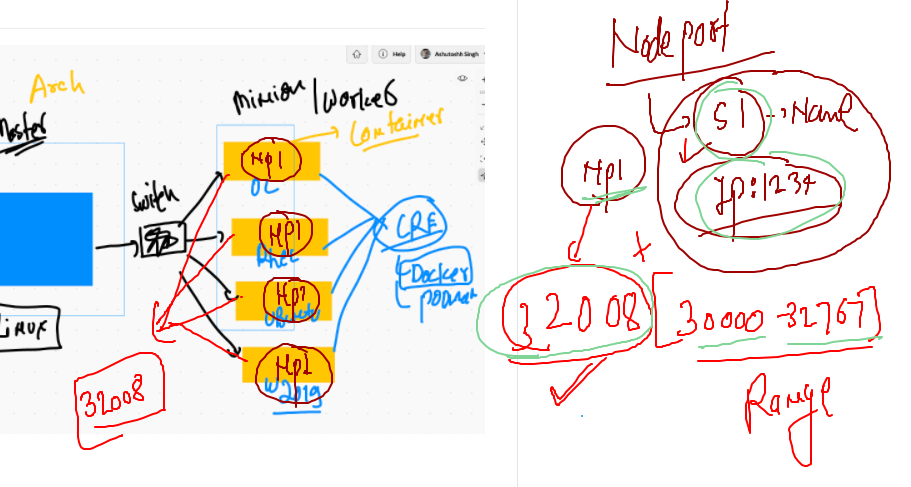

# ON client side of K8s cluster

## you can set admin.conf file persistently 

```
❯ cp  -v  ~/Desktop/admin.conf  ~/.kube/config
/Users/fire/Desktop/admin.conf -> /Users/fire/.kube/config


```

## checking it 


```
❯ kubectl  get  nodes
NAME           STATUS   ROLES                  AGE   VERSION
master-node    Ready    control-plane,master   18h   v1.20.4
minion-node1   Ready    <none>                 18h   v1.20.4
minion-node2   Ready    <none>                 18h   v1.20.4

```


## Why Pod IP can't be used to access application running in POd 


## more closure look 


### service can't user name/ IP of pod to forward traffic 


# SERVICE IN K8S

## service will connect to APISErver on master node -- etcd -- to find labeled POD 


## service type 


# Nodeport 



===


## Deploy pod with labels 

```
❯ kubectl  apply -f pod1.yaml
pod/ashupod-1 created
❯ kubectl  get  po
NAME        READY   STATUS    RESTARTS   AGE
ashupod-1   1/1     Running   0          5s
❯ kubectl  get  po  --show-labels
NAME        READY   STATUS    RESTARTS   AGE   LABELS
ashupod-1   1/1     Running   0          11s   <none>
❯ kubectl  apply -f pod1.yaml
pod/ashupod-1 configured
❯ kubectl  get  po  --show-labels
NAME        READY   STATUS    RESTARTS   AGE   LABELS
ashupod-1   1/1     Running   0          77s   x=helloashu

```
### creating nodeport service 

```
❯ kubectl  create  service  nodeport  ashusvc1  --tcp  1234:8080 --dry-run=client -o yaml
apiVersion: v1
kind: Service
metadata:
  creationTimestamp: null
  labels:
    app: ashusvc1
  name: ashusvc1
spec:
  ports:
  - name: 1234-8080
    port: 1234
    protocol: TCP
    targetPort: 8080
  selector:
    app: ashusvc1
  type: NodePort
status:
  loadBalancer: {}
❯ kubectl  create  service  nodeport  ashusvc1  --tcp  1234:8080 --dry-run=client -o yaml >nodeport.yaml

```
### api-resources shotforms 

```
10045  kubectl  get  nodes
10046  kubectl  get  no
10047  kubectl  get  pods
10048  kubectl  get  po
10049  kubectl  get  service
10050  kubectl  get  svc

```

### Deleteing pods and services

```
 kubectl  delete  svc  --all
service "ashusvc1" deleted
service "avijitsvc" deleted
service "avsvc1" deleted
service "balajic1c1" deleted
service "dharamsvs1" deleted
service "gowtsvc1" deleted
service "jeris1" deleted
service "kiranpod" deleted
service "kubernetes" deleted
service "prisvc1" deleted
service "shankypod" deleted
❯ kubectl  delete  po   --all
pod "ashupod-1" deleted
pod "avijitpod-1" deleted
pod "avpod-1" deleted
pod "balaji-1" deleted
pod "balajipod-1" deleted
pod "dharampod-2" deleted
pod "gowthampod-2" deleted
pod "jeripod-1" deleted
pod "kiranpod-1" deleted
pod "pripod-1" deleted
pod "shankypod-1" deleted
pod "titopod-1" deleted

```

# Replication Controller 


