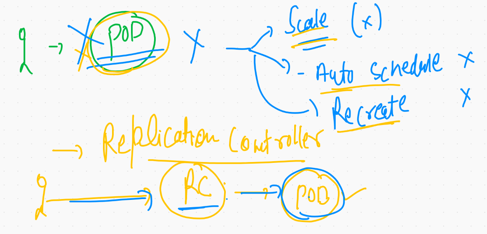

# FOr Docker only 
## volume & compose need to discusss


## Docker based application lifecycle 


## COntainer orchestration using Docker compose 


## Docker compose works and file version 


## COmpose installation 

[docker docs](https://docs.docker.com/compose/install/)

## Compose file format 


## Example 1

```
10216  cd ashuexample1
10217  ls
10218  docker-compose up  -d
10219  docker-compose ps
10220  docker-compose kill 
10221  docker-compose   ps
10222  docker-compose   start
10223  docker-compose   ps
10224  docker-compose   logs 

```

## to clean up all things 

```
❯ docker-compose down
Stopping ashuc1 ... done
Removing ashuc1 ... done
Removing network ashuexample1_default

```

### example 2

```
❯ cd ashujavawebapp

░▒▓ ~/Desktop/myimages/ashujavawebapp  master !1 ?1 ···························································· 11:33:43 AM ▓▒░─╮
❯                                                                                                                                  ─╯
❯ ls
Dockerfile         README.md          docker-compose.yml myapp
❯ docker-compose up -d
Creating network "ashujavawebapp_default" with the default driver
Creating ashuccc1 ... done
Creating ashucc11 ... done
❯ docker-compose  ps
  Name         Command       State           Ports         
-----------------------------------------------------------
ashucc11   catalina.sh run   Up      0.0.0.0:1133->8080/tcp
ashuccc1   ping 127.0.0.1    Up                            
❯ docker-compose kill  ashuapp22
Killing ashuccc1 ... done
❯ docker-compose ps
  Name         Command        State             Ports         
--------------------------------------------------------------
ashucc11   catalina.sh run   Up         0.0.0.0:1133->8080/tcp
ashuccc1   ping 127.0.0.1    Exit 137                         
❯ docker-compose  start
Starting ashujavaapp ... done
Starting ashuapp22   ... done
❯ docker-compose ps
  Name         Command       State           Ports         
-----------------------------------------------------------
ashucc11   catalina.sh run   Up      0.0.0.0:1133->8080/tcp
ashuccc1   ping 127.0.0.1    Up                            
❯ docker-compose kill
Killing ashucc11 ... done
Killing ashuccc1 ... done
❯ docker-compose rm
Going to remove ashucc11, ashuccc1
Are you sure? [yN] y
Removing ashucc11 ... done
Removing ashuccc1 ... done
❯ docker-compose down
Removing network ashujavawebapp_default

```

## Just docker is not good for production grade app deployment 


## CRE clustering and container orchestration 


## Info about Kubernetes 


# Kubernetes architecture  

## Level 1 


## level 2 -- kube-apiserver


## Level 3 -- kube-schedular 


## level 4 -- replication controller 




## Level 5 - ECTD 


## Minion Side there will be a distributed bridge for container ips 


## kube proxy 


## COntainer networking strategy


# K8s cluster deployment 


## Minikube more close look 


## Minikube version 

```
10269  curl -LO https://storage.googleapis.com/minikube/releases/latest/minikube-darwin-amd64
10270  sudo install minikube-darwin-amd64 /usr/local/bin/minikube
10271  minikube  version 

```

## creating cluster using docker  

```
 minikube  start   --driver=docker
😄  minikube v1.18.1 on Darwin 11.2.2
✨  Using the docker driver based on user configuration
👍  Starting control plane node minikube in cluster minikube
🚜  Pulling base image ...
💾  Downloading Kubernetes v1.20.2 preload ...
    > preloaded-images-k8s-v9-v1....: 379.69 MiB / 491.22 MiB  77.29% 9.80 MiB 


```


## checking status of cluster 

```
❯ minikube  start   --driver=docker
😄  minikube v1.18.1 on Darwin 11.2.2
✨  Using the docker driver based on user configuration
👍  Starting control plane node minikube in cluster minikube
🚜  Pulling base image ...
💾  Downloading Kubernetes v1.20.2 preload ...
    > preloaded-images-k8s-v9-v1....: 491.22 MiB / 491.22 MiB  100.00% 9.95 MiB
🔥  Creating docker container (CPUs=2, Memory=1990MB) ...
🐳  Preparing Kubernetes v1.20.2 on Docker 20.10.3 ...
    ▪ Generating certificates and keys ...
    ▪ Booting up control plane ...
    ▪ Configuring RBAC rules ...
🔎  Verifying Kubernetes components...
    ▪ Using image gcr.io/k8s-minikube/storage-provisioner:v4
🌟  Enabled addons: storage-provisioner, default-storageclass
🏄  Done! kubectl is now configured to use "minikube" cluster and "default" namespace by default
❯ minikube status
minikube
type: Control Plane
host: Running
kubelet: Running
apiserver: Running
kubeconfig: Configured
timeToStop: Nonexistent

```

## Minikube can automatically installed kubectl 


### checking version of cluster client and cluster

```
❯ kubectl    version
Client Version: version.Info{Major:"1", Minor:"20", GitVersion:"v1.20.2", GitCommit:"faecb196815e248d3ecfb03c680a4507229c2a56", GitTreeState:"clean", BuildDate:"2021-01-13T13:28:09Z", GoVersion:"go1.15.5", Compiler:"gc", Platform:"darwin/amd64"}
Server Version: version.Info{Major:"1", Minor:"20", GitVersion:"v1.20.2", GitCommit:"faecb196815e248d3ecfb03c680a4507229c2a56", GitTreeState:"clean", BuildDate:"2021-01-13T13:20:00Z", GoVersion:"go1.15.5", Compiler:"gc", Platform:"linux/amd64"}

```


### more client side commands 

```
 kubectl   cluster-info
Kubernetes control plane is running at https://127.0.0.1:55001
KubeDNS is running at https://127.0.0.1:55001/api/v1/namespaces/kube-system/services/kube-dns:dns/proxy

To further debug and diagnose cluster problems, use 'kubectl cluster-info dump'.

```

### checking number of nodes 

```
❯ kubectl   get  nodes
NAME       STATUS   ROLES                  AGE   VERSION
minikube   Ready    control-plane,master   21m   v1.20.2

```

## Multi Node cluster setup using Kubeadm 


## Step 1  to all the node

### set hostname for better understanding 

### thare are common steps to perform in all the nodes

```
[root@master-node ~]# cat  setup.sh 
#  disable swap memory 
swapoff -a
# enable kernel bridge driver for CNI networking 

modprobe br_netfilter
 echo '1' > /proc/sys/net/bridge/bridge-nf-call-iptables

 ## installing docker 
 yum  install docker -y
 systemctl start docker 
 systemctl enable docker 

 #  install kubeadm 

 cat  <<EOF  >/etc/yum.repos.d/kube.repo
[kube]
baseurl=https://packages.cloud.google.com/yum/repos/kubernetes-el7-x86_64
gpgcheck=0
EOF

yum  install kubeadm -y

systemctl enable --now kubelet 

```


## TO create Master nOde 

```
[root@master-node ~]# kubeadm  init  --pod-network-cidr=192.168.0.0/16  --apiserver-advertise-address=0.0.0.0   --apiserver-cert-extra-sans=54.157.82.186  
[init] Using Kubernetes version: v1.20.4
[preflight] Running pre-flight checks
	[WARNING IsDockerSystemdCheck]: detected "cgroupfs" as the Docker cgroup driver. The recommended driver is "systemd". Please follow the guide at https://kubernetes.io/docs/setup/cri/
	[WARNING FileExisting-tc]: tc not found in system path
	[WARNING Hostname]: hostname "master-node" could not be reached
	[WARNING Hostname]: hostname "master-node": lookup master-node on 172.31.0.2:53: no such host
[preflight] Pulling images required for setting up a Kubernetes cluster
[preflight] This might take a minute or two, depending on the speed of your internet connection
[preflight] You can also perform this action in beforehand using 'kubeadm config images pull'


### After some time (5 minute)


Your Kubernetes control-plane has initialized successfully!

To start using your cluster, you need to run the following as a regular user:

  mkdir -p $HOME/.kube
  sudo cp -i /etc/kubernetes/admin.conf $HOME/.kube/config
  sudo chown $(id -u):$(id -g) $HOME/.kube/config

Alternatively, if you are the root user, you can run:

  export KUBECONFIG=/etc/kubernetes/admin.conf

You should now deploy a pod network to the cluster.
Run "kubectl apply -f [podnetwork].yaml" with one of the options listed at:
  https://kubernetes.io/docs/concepts/cluster-administration/addons/

Then you can join any number of worker nodes by running the following on each as root:

kubeadm join 172.31.80.73:6443 --token s2ud0e.x9gtngzjkjoos7m6 \
    --discovery-token-ca-cert-hash sha256:ea4d70bfc0e056f3e5f009ef595f0e3ea1860594af7000da96efaa86b98f8528
    
```

## In all the system you want to configure as Minion Node you have paste that above command as root user 

### TO connect k8s cluster from Master Node its self 

```
[root@master-node ~]# export KUBECONFIG=/etc/kubernetes/admin.conf
[root@master-node ~]# 
[root@master-node ~]# 
[root@master-node ~]# kubectl  get  nodes

NAME           STATUS     ROLES                  AGE   VERSION
master-node    NotReady   control-plane,master   90s   v1.20.4
minion-node1   NotReady   <none>                 61s   v1.20.4
minion-node2   NotReady   <none>                 57s   v1.20.4

```

## Note: as you can see Nodes are not in ready state because of CNI is not deployed

## Deploying Calico from Master Node 

```
[root@master-node ~]# wget https://docs.projectcalico.org/manifests/calico.yaml
--2021-03-10 10:00:27--  https://docs.projectcalico.org/manifests/calico.yaml
Resolving docs.projectcalico.org (docs.projectcalico.org)... 52.73.153.209, 54.205.240.192, 2604:a880:400:d0::186a:3001, ...
Connecting to docs.projectcalico.org (docs.projectcalico.org)|52.73.153.209|:443... connected.
HTTP request sent, awaiting response... 200 OK
Length: 189190 (185K) [text/yaml]
Saving to: 'calico.yaml'

100%[============================================================================================>] 189,190     --.-K/s   in 0.005s  

2021-03-10 10:00:27 (35.7 MB/s) - 'calico.yaml' saved [189190/189190]

[root@master-node ~]# 
[root@master-node ~]# ls
calico.yaml  setup.sh
[root@master-node ~]# kubectl apply  -f  calico.yaml 
configmap/calico-config created
customresourcedefinition.apiextensions.k8s.io/bgpconfigurations.crd.projectcalico.org created
customresourcedefinition.apiextensions.k8s.io/bgppeers.crd.projectcalico.org created
customresourcedefinition.apiextensions.k8s.io/blockaffinities.crd.projectcalico.org created
customresourcedefinition.apiextensions.k8s.io/clusterinformations.crd.projectcalico.org created
customresourcedefinition.apiextensions.k8s.io/felixconfigurations.crd.projectcalico.org created
customresourcedefinition.apiextensions.k8s.io/globalnetworkpolicies.crd.projectcalico.org created
customresourcedefinition.apiextensions.k8s.io/globalnetworksets.crd.projectcalico.org created
customresourcedefinition.apiextensions.k8s.io/hostendpoints.crd.projectcalico.org created
customresourcedefinition.apiextensions.k8s.io/ipamblocks.crd.projectcalico.org created
customresourcedefinition.apiextensions.k8s.io/ipamconfigs.crd.projectcalico.org created
customresourcedefinition.apiextensions.k8s.io/ipamhandles.crd.projectcalico.org created
customresourcedefinition.apiextensions.k8s.io/ippools.crd.projectcalico.org created
customresourcedefinition.apiextensions.k8s.io/kubecontrollersconfigurations.crd.projectcalico.org created
customresourcedefinition.apiextensions.k8s.io/networkpolicies.crd.projectcalico.org created
customresourcedefinition.apiextensions.k8s.io/networksets.crd.projectcalico.org created
clusterrole.rbac.authorization.k8s.io/calico-kube-controllers created
clusterrolebinding.rbac.authorization.k8s.io/calico-kube-controllers created
clusterrole.rbac.authorization.k8s.io/calico-node created
clusterrolebinding.rbac.authorization.k8s.io/calico-node created
daemonset.apps/calico-node created
serviceaccount/calico-node created
deployment.apps/calico-kube-controllers created
serviceaccount/calico-kube-controllers created
poddisruptionbudget.policy/calico-kube-controllers created

```

## checking nodes again 

```
[root@master-node ~]# kubectl  get  nodes
NAME           STATUS   ROLES                  AGE     VERSION
master-node    Ready    control-plane,master   4m29s   v1.20.4
minion-node1   Ready    <none>                 4m      v1.20.4
minion-node2   Ready    <none>                 3m56s   v1.20.4

```


