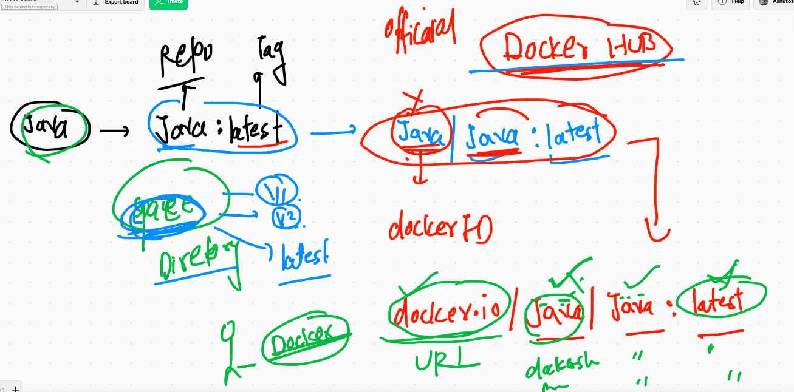

# recap of day1

## Image inspect and gathering information 

```
 docker  inspect  ashupython:v001  -f '{{.Author}}'
ashutoshh@linux.com
❯ docker  inspect  ashupython:v001  -f '{{.Id}}'
sha256:a60063941b128bff86b5ef8aa6c14cb36d64f5fd19c0fc7b9902c16c92848215
❯ docker  inspect  ashupython:v001  -f '{{.ContainerConfig.Hostname}}'
5a6ba4e74f7f
❯ docker  inspect  ashupython:v001  -f '{{.Config.Cmd}}'
[python3 /mycode/hello.py]

```

## Namespaces 


## Cgroups 


===


## checking stats of running container 


## apply cgroups 

```
  docker run -itd --name ashuc2  --memory 100m --cpu-shares=20 alpine ping google.com 
```
 
 
 ## restrict existing existing container 
 
 ```
  docker update  x1ashu --cpu-shares=30
x1ashu
❯ docker update  x1ashu --memory=200m
```

## Sharing docker image with other teams with the world 


### image save locally on CLient side 

```

 docker  save -o  mywebimg.tar  ashuhttpd:v1
❯ ls
ashu.png         hello.html       httpd.dockerfile mywebimg.tar
❯ 

```
### remove image

```
❯ docker  rmi  ashuhttpd:v1
Untagged: ashuhttpd:v1
Deleted: sha256:e42c9d38ef34afdad70e327c48370b679de21fd200fa605904db6841eac0c9c4
Deleted: sha256:58af457e40cb91dbbd1dbaed7accebee3d8c560a3318bc639bdafe9b7316fe09
Deleted: sha256:f1d6c5479e84764902acd353d7e040e414e850917496a5dd3fedcd2f284f2036
Deleted: sha256:d378e90a26e42879e9d9beda9cddcb69b220ecba6f28be408df1030c009b1901
Deleted: sha256:260a1e787e6851bdfe0d351da561045addee3a5b37cb1eb81c42d0384e771514
Deleted: sha256:bab55b5636ce7e5c7aa64c0ffdd983d2489b3d2a607769462301c4abf871d0d1

```

###  image restore to docker engine from client system 

```
❯ docker load -i  mywebimg.tar
a74e47f90ac6: Loading layer [==================================================>]  3.584kB/3.584kB
e81b90723b4d: Loading layer [==================================================>]  122.9kB/122.9kB
Loaded image: ashuhttpd:v1

```

## image registry 


## DOcker hub image name 




## pushimg image to docker HUb 

```
 docker  tag  ashuhttpd:v1  dockerashu/ashuhttpd:v1
❯ 
❯ docker login
Login with your Docker ID to push and pull images from Docker Hub. If you don't have a Docker ID, head over to https://hub.docker.com to create one.
Username: dockerashu
Password: 
Login Succeeded
❯ docker  push dockerashu/ashuhttpd:v1
The push refers to repository [docker.io/dockerashu/ashuhttpd]
e81b90723b4d: Pushed 
a74e47f90ac6: Pushed 
a1b88d5b9785: Pushed 
d0054f212bd1: Layer already exists 
v1: digest: sha256:71eac419093f7ee3c191737ae462bff1871427ecc979f4bb7ddcbe8aa1f3441e size: 1158
❯ 
❯ docker  logout
Removing login credentials for https://index.docker.io/v1/

```

## anthoer IDea of docker registry 


## Java based application 

```
10091  docker  build  -t   ashutomcat:v1 .
10092  history
10093  docker  build  -t   dockerashu/ashutomcat:v1 .
❯ docker  login -u dockerashu
Password: 
Login Succeeded
❯ docker push  dockerashu/ashutomcat:v1
The push refers to repository [docker.io/dockerashu/ashutomcat]
4670a1e9be5b: Pushed 
c4f1ce0a5e5f: Pushed 
bf9340433aef: Pushed 
7fb88fd31920: Mounted from library/tomcat 
27513d995379: Mounted from library/tomcat 
fcbe7aa3012d: Mounted from library/tomcat 
ebab439b6c1b: Mounted from library/tomcat 
c44cd007351c: Mounted from library/tomcat 
02f0a7f763a3: Mounted from library/tomcat 
da654bc8bc80: Mounted from library/tomcat 
4ef81dc52d99: Mounted from library/tomcat 
909e93c71745: Mounted from library/tomcat 
7f03bfe4d6dc: Mounted from library/tomcat 
v1: digest: sha256:87107b57ef60a16417a66f42ab4a94da49057215d252bfcdc2fd207a1173177c size: 3044


```


