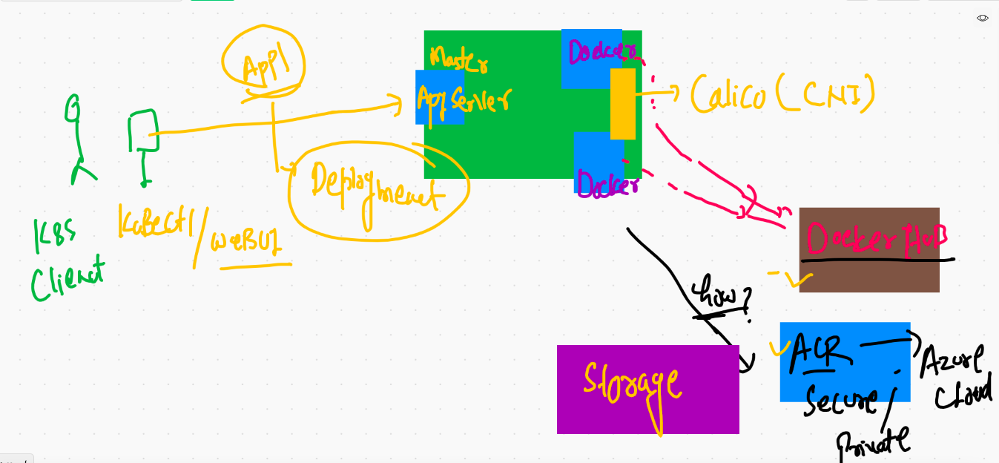

# Welcome to Last day of K8s training 

## Application deployment model flow 


## application deployment model




# Deployment best practise again 

## Building version 1 of web app from Github code 

```
❯ docker  build  -t  dockerashu/mywebapp:v1  https://github.com/redashu/mywebapp.git#main
Sending build context to Docker daemon  292.9kB
Step 1/7 : FROM oraclelinux:8.3
 ---> d8ccb1b24024
Step 2/7 : MAINTAINER ashutoshh@linux.com
 ---> Using cache
 ---> d7e62726d788
Step 3/7 : RUN dnf install httpd -y
 ---> Using cache
 ---> 7a21331ce6f0
Step 4/7 : COPY index.html /var/www/html/index.html
 ---> 1b04876e72e0
Step 5/7 : COPY friends.png /var/www/html/friends.png
 ---> d192d9e7d29e
Step 6/7 : EXPOSE 80
 ---> Running in 48561d1de7fd
Removing intermediate container 48561d1de7fd
 ---> c8e448438944
Step 7/7 : ENTRYPOINT httpd -DFOREGROUND
 ---> Running in b5196bbf7d48
Removing intermediate container b5196bbf7d48
 ---> 9ffc6de873aa
Successfully built 9ffc6de873aa
Successfully tagged dockerashu/mywebapp:v1


```

## Cleaning my namespace before new deployment 

```
❯ kubectl  delete all --all -n m-space
pod "ashudep1-5bd796f4d8-sbxjs" deleted
pod "ashudep1-5bd796f4d8-t4xps" deleted
pod "ashudep1-5bd796f4d8-vfv2t" deleted
pod "dharam11-78cb4d9bcb-ftrlg" deleted
service "ashusvc1" deleted
service "dharamsvc123" deleted
deployment.apps "ashudep1" deleted
deployment.apps "dharam11" deleted
replicaset.apps "ashudep1-5bd796f4d8" deleted
replicaset.apps "ashudep1-6fc5566fc5" deleted

```


## deployment of application from Docker hub 

```
❯ ls
aa.txt           ashurc1.yaml     dockerhubdep.yml multiapp         mypoddd.yaml     pod1.yaml
al.yml           autopod.yaml     hello.yaml       mydep.yml        nodeport.yaml
❯ kubectl  apply  -f  dockerhubdep.yml
deployment.apps/ashuwebapp created
❯ 
❯ 
❯ kubectl   get  deploy  -n m-space
NAME         READY   UP-TO-DATE   AVAILABLE   AGE
ashuwebapp   1/1     1            1           16s
❯ kubectl   get  rs  -n m-space
NAME                    DESIRED   CURRENT   READY   AGE
ashuwebapp-5fd4f7dd5c   1         1         1       22s
❯ kubectl   get pod  -n m-space
NAME                          READY   STATUS    RESTARTS   AGE
ashuwebapp-5fd4f7dd5c-lns7s   1/1     Running   0          28s


```

### create service 

```

10032  docker  login  -u dockerashu 
10033  docker push dockerashu/mywebapp:v1 
10034  docker  tag  dockerashu/mywebapp:v1  oracleteam.azurecr.io/mywebapp:v1  
10035  docker login  oracleteam.azurecr.io  -u  oracleteam 
10036  docker push oracleteam.azurecr.io/mywebapp:v1 
10037  history
10038  cd Desktop/oraclemarch82021/k8sapps
10039  ls
10040  kubectl  create  deployment   ashuwebapp   --image= dockerashu/mywebapp:v1  --dry-run=client -o yaml 
10041  kubectl  create  deployment   ashuwebapp   --image=dockerashu/mywebapp:v1  --dry-run=client -o yaml 
10042  history
10043  kubectl  create  deployment   ashuwebapp   --image=dockerashu/mywebapp:v1  --dry-run=client -o yaml  >dockerhubdep.yml
10044  kubectl get  ns
10045  kubectl  delete all --all -n m-space 
10046  kubectl  get  pod,svc  -n  m-space 
10047  history
10048  ls
10049  kubectl  apply  -f  dockerhubdep.yml  
10050  kubectl   get  deploy  -n m-space 
10051  kubectl   get  rs  -n m-space 
10052  kubectl   get pod  -n m-space 
10053  kubectl  get  ns
10054  history   |   grep -i curr
10055  kubectl  get  deploy 
10056  kubectl  get  rs
10057  kubectl  get  pod
10058  kubectl  get  deploy,rs,pod 
10059  kubectl  get  deploy,rs,pod  -n m-space 
10060  history
10061  kubectl   get  deploy  
10062  kubectl   get  deploy   -n m-space 
❯ 
❯ kubectl  get  deploy
NAME         READY   UP-TO-DATE   AVAILABLE   AGE
ashuwebapp   1/1     1            1           7m13s
❯ kubectl  get  deploy  -n m-space
NAME         READY   UP-TO-DATE   AVAILABLE   AGE
ashuwebapp   1/1     1            1           7m23s
❯ 
❯ 
❯ kubectl  expose  deployment  ashuwebapp  --type NodePort --port 1234 --target-port 80  --name mysvc1 -n m-space
service/mysvc1 exposed
❯ kubectl  get  svc -n m-space
NAME     TYPE       CLUSTER-IP      EXTERNAL-IP   PORT(S)          AGE
mysvc1   NodePort   10.98.180.212   <none>        1234:31396/TCP   38s


```

## scaling pods using deployment 

```
❯ kubectl  get   all  -n m-space
NAME                              READY   STATUS    RESTARTS   AGE
pod/ashuwebapp-5fd4f7dd5c-lns7s   1/1     Running   0          45m

NAME             TYPE       CLUSTER-IP      EXTERNAL-IP   PORT(S)          AGE
service/mysvc1   NodePort   10.98.180.212   <none>        1234:31396/TCP   38m

NAME                         READY   UP-TO-DATE   AVAILABLE   AGE
deployment.apps/ashuwebapp   1/1     1            1           46m

NAME                                    DESIRED   CURRENT   READY   AGE
replicaset.apps/ashuwebapp-5fd4f7dd5c   1         1         1       46m
❯ kubectl  get   po  -n m-space
NAME                          READY   STATUS    RESTARTS   AGE
ashuwebapp-5fd4f7dd5c-lns7s   1/1     Running   0          47m
❯ kubectl scale  deploy ashuwebapp --replicas=3  -n m-space
deployment.apps/ashuwebapp scaled
❯ 
❯ kubectl  get   po  -n m-space
NAME                          READY   STATUS    RESTARTS   AGE
ashuwebapp-5fd4f7dd5c-6v7hk   1/1     Running   0          3s
ashuwebapp-5fd4f7dd5c-jxmwb   1/1     Running   0          3s
ashuwebapp-5fd4f7dd5c-lns7s   1/1     Running   0          47m

```

## End user respected deployment 


