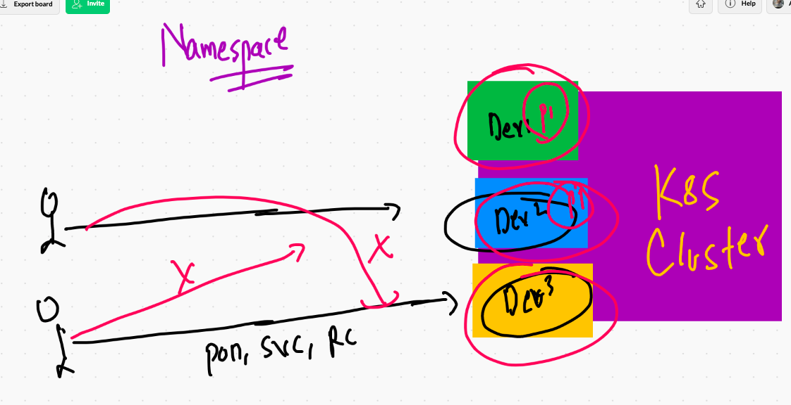
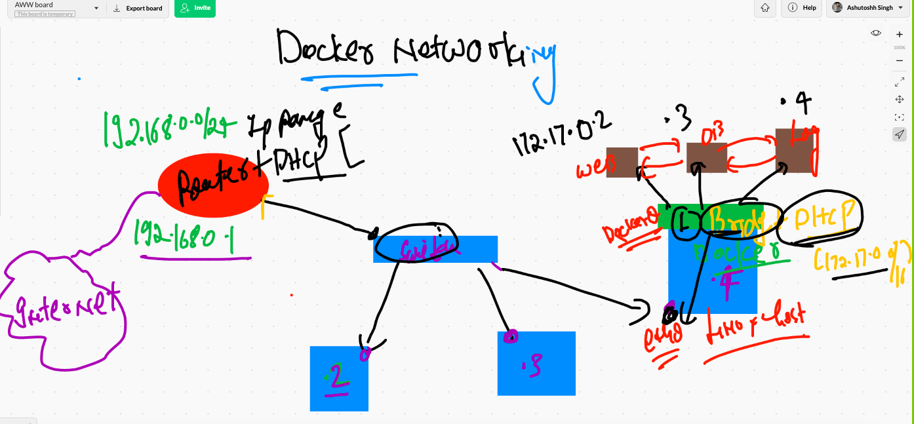

# recap of day1

## Image inspect and gathering information 

```
 docker  inspect  ashupython:v001  -f '{{.Author}}'
ashutoshh@linux.com
❯ docker  inspect  ashupython:v001  -f '{{.Id}}'
sha256:a60063941b128bff86b5ef8aa6c14cb36d64f5fd19c0fc7b9902c16c92848215
❯ docker  inspect  ashupython:v001  -f '{{.ContainerConfig.Hostname}}'
5a6ba4e74f7f
❯ docker  inspect  ashupython:v001  -f '{{.Config.Cmd}}'
[python3 /mycode/hello.py]

```

## Namespaces 



## Cgroups 


===


## checking stats of running container 


## apply cgroups 

```
  docker run -itd --name ashuc2  --memory 100m --cpu-shares=20 alpine ping google.com 
```
 
 
 ## restrict existing existing container 
 
 ```
  docker update  x1ashu --cpu-shares=30
x1ashu
❯ docker update  x1ashu --memory=200m
```

## Sharing docker image with other teams with the world 


### image save locally on CLient side 

```

 docker  save -o  mywebimg.tar  ashuhttpd:v1
❯ ls
ashu.png         hello.html       httpd.dockerfile mywebimg.tar
❯ 

```
### remove image

```
❯ docker  rmi  ashuhttpd:v1
Untagged: ashuhttpd:v1
Deleted: sha256:e42c9d38ef34afdad70e327c48370b679de21fd200fa605904db6841eac0c9c4
Deleted: sha256:58af457e40cb91dbbd1dbaed7accebee3d8c560a3318bc639bdafe9b7316fe09
Deleted: sha256:f1d6c5479e84764902acd353d7e040e414e850917496a5dd3fedcd2f284f2036
Deleted: sha256:d378e90a26e42879e9d9beda9cddcb69b220ecba6f28be408df1030c009b1901
Deleted: sha256:260a1e787e6851bdfe0d351da561045addee3a5b37cb1eb81c42d0384e771514
Deleted: sha256:bab55b5636ce7e5c7aa64c0ffdd983d2489b3d2a607769462301c4abf871d0d1

```

###  image restore to docker engine from client system 

```
❯ docker load -i  mywebimg.tar
a74e47f90ac6: Loading layer [==================================================>]  3.584kB/3.584kB
e81b90723b4d: Loading layer [==================================================>]  122.9kB/122.9kB
Loaded image: ashuhttpd:v1

```

## image registry 


## DOcker hub image name 


## pushimg image to docker HUb 

```
 docker  tag  ashuhttpd:v1  dockerashu/ashuhttpd:v1
❯ 
❯ docker login
Login with your Docker ID to push and pull images from Docker Hub. If you don't have a Docker ID, head over to https://hub.docker.com to create one.
Username: dockerashu
Password: 
Login Succeeded
❯ docker  push dockerashu/ashuhttpd:v1
The push refers to repository [docker.io/dockerashu/ashuhttpd]
e81b90723b4d: Pushed 
a74e47f90ac6: Pushed 
a1b88d5b9785: Pushed 
d0054f212bd1: Layer already exists 
v1: digest: sha256:71eac419093f7ee3c191737ae462bff1871427ecc979f4bb7ddcbe8aa1f3441e size: 1158
❯ 
❯ docker  logout
Removing login credentials for https://index.docker.io/v1/

```

## anthoer IDea of docker registry 


## Java based application 

```
10091  docker  build  -t   ashutomcat:v1 .
10092  history
10093  docker  build  -t   dockerashu/ashutomcat:v1 .
❯ docker  login -u dockerashu
Password: 
Login Succeeded
❯ docker push  dockerashu/ashutomcat:v1
The push refers to repository [docker.io/dockerashu/ashutomcat]
4670a1e9be5b: Pushed 
c4f1ce0a5e5f: Pushed 
bf9340433aef: Pushed 
7fb88fd31920: Mounted from library/tomcat 
27513d995379: Mounted from library/tomcat 
fcbe7aa3012d: Mounted from library/tomcat 
ebab439b6c1b: Mounted from library/tomcat 
c44cd007351c: Mounted from library/tomcat 
02f0a7f763a3: Mounted from library/tomcat 
da654bc8bc80: Mounted from library/tomcat 
4ef81dc52d99: Mounted from library/tomcat 
909e93c71745: Mounted from library/tomcat 
7f03bfe4d6dc: Mounted from library/tomcat 
v1: digest: sha256:87107b57ef60a16417a66f42ab4a94da49057215d252bfcdc2fd207a1173177c size: 3044


```

## CMD vs Entrypoint 

```
0098  docker  inspect  ashuhttpd:v1  -f  '{{.Config.Cmd}}'
10099  docker rm $(docker ps -aq) -f
10100  docker run -itd --name x1  ashuhttpd:v1   ping 127.0.0.1 
10101  docker  ps
10102  cd ../webapp
10103  docker build -f httpd.dockerfile -t  ashuhttpd:v2 .
10104  docker run -itd --name x2  ashuhttpd:v2   ping 127.0.0.1 
10105  docker  ps
10106  docker build -f httpd.dockerfile -t  ashuhttpd:v2 .
10107  docker run -itd --name x3  ashuhttpd:v2   ping 127.0.0.1 
10108  docker  ps
10109  docker run -itd --name x4  --entrypoint ping 127.0.0.1   ashuhttpd:v2   
10110  docker run -itd --name x4  --entrypoint="ping 127.0.0.1"   ashuhttpd:v2   
10111  docker run -itd --name x4  --entrypoint ping 127.0.0.1   ashuhttpd:v2   
10112  docker run -itd --name x4  --entrypoint="sleep 600"   ashuhttpd:v2   
10113  docker run -itd --name x5  --entrypoint="sleep 600"   ashuhttpd:v2  

```

# Docker networking 

## real and docker networking scene 



### default network bridges 

```
❯ docker  network   ls
NETWORK ID     NAME      DRIVER    SCOPE
8aaffe198eaa   bridge    bridge    local
aecb53e7d2c2   host      host      local
97232a13bf47   none      null      local

```

### Inspecting default bridge that is alos docker0

```
❯ docker  network   inspect  8aaffe198eaa
[
    {
        "Name": "bridge",
        "Id": "8aaffe198eaaab884b615ee03f4a803e1896362f41a3d18e287030a9c9bc1a99",
        "Created": "2021-03-09T04:05:13.612770582Z",
        "Scope": "local",
        "Driver": "bridge",
        "EnableIPv6": false,
        "IPAM": {
            "Driver": "default",
            "Options": null,
            "Config": [
                {
                    "Subnet": "172.17.0.0/16",
                    "Gateway": "172.17.0.1"
                }
            ]
        },
        "Internal": false,
        "Attachable": false,
        "Ingress": false,
        "ConfigFrom": {
            "Network": ""
        },
        "ConfigOnly": false,
        "Containers": {},
        "Options": {
            "com.docker.network.bridge.default_bridge": "true",
            "com.docker.network.bridge.enable_icc": "true",
            "com.docker.network.bridge.enable_ip_masquerade": "true",
            "com.docker.network.bridge.host_binding_ipv4": "0.0.0.0",
            "com.docker.network.bridge.name": "docker0",
            "com.docker.network.driver.mtu": "1500"
        },
        "Labels": {}
    }
]

```

## inspect default bridge to see all the connected container 

```
❯ docker  network  inspect  bridge
[
    {
        "Name": "bridge",
        "Id": "8aaffe198eaaab884b615ee03f4a803e1896362f41a3d18e287030a9c9bc1a99",
        "Created": "2021-03-09T04:05:13.612770582Z",
        "Scope": "local",
        "Driver": "bridge",
        "EnableIPv6": false,
        "IPAM": {
            "Driver": "default",
            "Options": null,
            "Config": [
                {
                    "Subnet": "172.17.0.0/16",
                    "Gateway": "172.17.0.1"
                }
            ]
        },
        "Internal": false,
        "Attachable": false,
        "Ingress": false,
        "ConfigFrom": {
            "Network": ""
        },
        "ConfigOnly": false,
        "Containers": {
            "0fa02884255fe4b043b926bc588be71fc0ca4c0f5b6a4b453c3f6cd21a013143": {
                "Name": "jerijava",
                "EndpointID": "6b8b03aca2a3bdb279e52ccb799f4b6c775d000ba94de6983e0d2e152fd411ec",
                "MacAddress": "02:42:ac:11:00:03",
                "IPv4Address": "172.17.0.3/16",
                "IPv6Address": ""
            },
            "1a9086669ff960f487e3819818f85ce9d97b153fdb5853269a0a5901180cefce": {
                "Name": "gowt",
                "EndpointID": "c973da7135378e746ff4f6f26913d955c38b75c54439a19ded3f46c96766a1a3",
                "MacAddress": "02:42:ac:11:00:07",
                "IPv4Address": "172.17.0.7/16",
                "IPv6Address": ""
            },
            "2eb42f054f20fbe3fab1e87f33c2239b3cd87a3aae719b686f30888ed2d2d6be": {
                "Name": "AV",
                "EndpointID": "feceb829ababaa8150996b83193003410e8378429416f6e9a0610b5c900e09bb",
                "MacAddress": "02:42:ac:11:00:06",
                "IPv4Address": "172.17.0.6/16",
                "IPv6Address": ""
            },
            "8cd6c8b3e51821840b11697c401b3201fa061a4daeedb7a818ea2fb787914b50": {
                "Name": "sankalita",
                "EndpointID": "8acd8272ab5faa252ed476f89d037f7d90c3067f51334ff7c2720371d929dc7e",
                "MacAddress": "02:42:ac:11:00:05",
                "IPv4Address": "172.17.0.5/16",
                "IPv6Address": ""
            },
            "a111a65d968667b0ff7ce16bd5224a14a5dc120e8af896553b1d0775ae5d6891": {
                "Name": "balajiii",

```

## alternative way of checking ip for a particular container 

```
10126  docker  network ls 
10127  docker  network  inspect  bridge 
10128  history
10129  docker  ps
10130  docker  inspect  ashux1  
10131  docker  inspect  ashux1   -f '{{.NetworkSettings.IPAddress}}'
10132  docker ps
10133  docker  inspect  dharam1   -f '{{.NetworkSettings.IPAddress}}'
10134  docker  inspect  dharam1   -f '{{.NetworkSettings.MacAddress}}'

```

## COntainer can connect to outside world using NAT 

### container IP ---Translating---> Host IP 


### Port forwarding 


## creating custom bridge 

```
❯ docker  network  create   ashubr1  --subnet   192.168.1.0/24
1cbae872075e11348c0eec93e9c27b1d106ad9ac8f991b406e848823823b5eb5
❯ docker  network  ls
NETWORK ID     NAME      DRIVER    SCOPE
1cbae872075e   ashubr1   bridge    local
8aaffe198eaa   bridge    bridge    local
aecb53e7d2c2   host      host      local
97232a13bf47   none      null      local


```

## Custom bridge

```
  docker  network  create   ashubr1  --subnet   192.168.1.0/24 
  
  10155  docker run -idt --name ashuxc1  --network ashubr1  alpine ping 127.0.0.1 
10156  docker run -idt --name ashuxc2  --network ashubr1 --ip 192.168.1.100  alpine ping 127.0.0.1 

```

### custom bride 


## testing above container 

```
❯ docker  exec -it  ashuxc2  sh
/ # ifconfig 
eth0      Link encap:Ethernet  HWaddr 02:42:C0:A8:01:64  
          inet addr:192.168.1.100  Bcast:192.168.1.255  Mask:255.255.255.0
          UP BROADCAST RUNNING MULTICAST  MTU:1500  Metric:1
          RX packets:10 errors:0 dropped:0 overruns:0 frame:0
          TX packets:0 errors:0 dropped:0 overruns:0 carrier:0
          collisions:0 txqueuelen:0 
          RX bytes:796 (796.0 B)  TX bytes:0 (0.0 B)

lo        Link encap:Local Loopback  
          inet addr:127.0.0.1  Mask:255.0.0.0
          UP LOOPBACK RUNNING  MTU:65536  Metric:1
          RX packets:232 errors:0 dropped:0 overruns:0 frame:0
/ # ifconfig 
eth0      Link encap:Ethernet  HWaddr 02:42:C0:A8:01:64  
          inet addr:192.168.1.100  Bcast:192.168.1.255  Mask:255.255.255.0
          UP BROADCAST RUNNING MULTICAST  MTU:1500  Metric:1
          RX packets:10 errors:0 dropped:0 overruns:0 frame:0
          TX packets:0 errors:0 dropped:0 overruns:0 carrier:0
          collisions:0 txqueuelen:0 
          RX bytes:796 (796.0 B)  TX bytes:0 (0.0 B)

lo        Link encap:Local Loopback  
          inet addr:127.0.0.1  Mask:255.0.0.0
          UP LOOPBACK RUNNING  MTU:65536  Metric:1
          RX packets:248 errors:0 dropped:0 overruns:0 frame:0
          TX packets:248 errors:0 dropped:0 overruns:0 carrier:0
          collisions:0 txqueuelen:1000 
          RX bytes:20832 (20.3 KiB)  TX bytes:20832 (20.3 KiB)

/ # ping 192.168.1.2
PING 192.168.1.2 (192.168.1.2): 56 data bytes
64 bytes from 192.168.1.2: seq=0 ttl=255 time=0.137 ms
64 bytes from 192.168.1.2: seq=1 ttl=255 time=0.099 ms
^C
--- 192.168.1.2 ping statistics ---
2 packets transmitted, 2 packets received, 0% packet loss
round-trip min/avg/max = 0.099/0.118/0.137 ms
/ # ping  ashuxc1 
PING ashuxc1 (192.168.1.2): 56 data bytes
64 bytes from 192.168.1.2: seq=0 ttl=255 time=0.088 ms
64 bytes from 192.168.1.2: seq=1 ttl=255 time=0.218 ms
64 bytes from 192.168.1.2: seq=2 ttl=255 time=0.101 ms
^C
--- ashuxc1 ping statistics ---
3 packets transmitted, 3 packets received, 0% packet loss
round-trip min/avg/max = 0.088/0.135/0.218 ms
/ # 

```

## To delete bridge you have to delete all the containers first 

```
❯ docker  network  prune
WARNING! This will remove all custom networks not used by at least one container.
Are you sure you want to continue? [y/N] y
Deleted Networks:
avbr1
titobridge
jeribridge
dharambr1
ashubr1
ravibr1
gowtham
shankybridge
balaji
prinet1
avij1
kiran

❯ docker  network ls
NETWORK ID     NAME      DRIVER    SCOPE
8aaffe198eaa   bridge    bridge    local
aecb53e7d2c2   host      host      local
97232a13bf47   none      null      local

```

# Storage in Docker 

## type 


### steps for Storage Engineer

```
[root@ip-172-31-86-132 docker]# lsblk 
NAME          MAJ:MIN RM SIZE RO TYPE MOUNTPOINT
nvme0n1       259:0    0  59G  0 disk 
|-nvme0n1p1   259:1    0  59G  0 part /
`-nvme0n1p128 259:2    0   1M  0 part 
[root@ip-172-31-86-132 docker]# lsblk 
NAME          MAJ:MIN RM  SIZE RO TYPE MOUNTPOINT
nvme0n1       259:0    0   59G  0 disk 
|-nvme0n1p1   259:1    0   59G  0 part /
`-nvme0n1p128 259:2    0    1M  0 part 
nvme1n1       259:3    0  100G  0 disk 
[root@ip-172-31-86-132 docker]# mkfs.xfs   /dev/nvme1n1 
meta-data=/dev/nvme1n1           isize=512    agcount=4, agsize=6553600 blks
         =                       sectsz=512   attr=2, projid32bit=1
         =                       crc=1        finobt=1, sparse=0
data     =                       bsize=4096   blocks=26214400, imaxpct=25
         =                       sunit=0      swidth=0 blks
naming   =version 2              bsize=4096   ascii-ci=0 ftype=1
log      =internal log           bsize=4096   blocks=12800, version=2
         =                       sectsz=512   sunit=0 blks, lazy-count=1
realtime =none                   extsz=4096   blocks=0, rtextents=0
[root@ip-172-31-86-132 docker]# mkdir  /oracleDE 
[root@ip-172-31-86-132 docker]# mount  /dev/nvme1n1  /oracleDE/
[root@ip-172-31-86-132 docker]# vim /etc/fstab 
[root@ip-172-31-86-132 docker]# mount -a


```

### Steps for Docker engineer 

```
[root@ip-172-31-86-132 oracleDE]# cd  /etc/sysconfig/
[root@ip-172-31-86-132 sysconfig]# ls
acpid       clock     docker          init        modules          nfs            rpc-rquotad  run-parts  sysstat.ioconf
atd         console   docker-storage  irqbalance  netconsole       raid-check     rpcbind      selinux
authconfig  cpupower  grub            keyboard    network          rdisc          rsyncd       sshd
chronyd     crond     i18n            man-db      network-scripts  readonly-root  rsyslog      sysstat
[root@ip-172-31-86-132 sysconfig]# 
[root@ip-172-31-86-132 sysconfig]# vim docker
[root@ip-172-31-86-132 sysconfig]# systemctl daemon-reload 
[root@ip-172-31-86-132 sysconfig]# systemctl restart docker 


===
[root@ip-172-31-86-132 sysconfig]# cat docker
# The max number of open files for the daemon itself, and all
# running containers.  The default value of 1048576 mirrors the value
# used by the systemd service unit.
DAEMON_MAXFILES=1048576

# Additional startup options for the Docker daemon, for example:
# OPTIONS="--ip-forward=true --iptables=true"
# By default we limit the number of open files per container
OPTIONS="--default-ulimit nofile=1024:4096 -H tcp://0.0.0.0:2375 -g  /oracleDE"

# How many seconds the sysvinit script waits for the pidfile to appear
# when starting the daemon.

```

## TO sync data from old location to New location 

```
 rsync  -avp  /var/lib/docker/   /oracleDE/ 
 
 systemctl restart docker
 
 ```
 
 ## COntainer Storage 
 
 ### creating volume 
 
 ```
 ❯ docker  volume  create  helloashu
helloashu
❯ docker  volume  ls
DRIVER    VOLUME NAME
local     87fc334060fc75461391b7b563480b7df9bc24df50ee49c02a10f9c527303379
local     afe1fbe440ccdfe0998c54995fe95f0a6055018b9ffc36bc33018d1664f8506b
local     helloashu
❯ docker  volume  ls
DRIVER    VOLUME NAME
local     87fc334060fc75461391b7b563480b7df9bc24df50ee49c02a10f9c527303379
local     afe1fbe440ccdfe0998c54995fe95f0a6055018b9ffc36bc33018d1664f8506b
local     dharamvol
local     helloashu


```

## volume using docker 

```
10187  docker  volume  create  helloashu
10188  docker  volume  ls
10189  history
10190  docker rm  x2 
10191  docker  run  --name x1  -it -v  helloashu:/mybackup:ro   oraclelinux:8.3  bash 
10192  docker  run  --name x11   -it -v  helloashu:/mybackup:ro   oraclelinux:8.3  bash 
❯ docker  run  -it  --rm  -v  helloashu:/kk:ro   alpine sh
/ # cd  /kk/
/kk # ls
hello  is     me     this   world
/kk # mkdir fine
mkdir: can't create directory 'fine': Read-only file system
/kk # rmdir hello
rmdir: 'hello': Read-only file system
/kk # 
❯ docker  run  -it  --rm  -v  helloashu:/kk   alpine sh
/ # cd  /kk/
/kk # ls
hello  is     me     this   world
/kk # mkdir fine 
/kk # rmdir hello/

```

### where volume store data : --- Server Side 

```
❯ docker  volume  inspect  helloashu
[
    {
        "CreatedAt": "2021-03-09T11:01:06Z",
        "Driver": "local",
        "Labels": {},
        "Mountpoint": "/oracleDE/volumes/helloashu/_data",
        "Name": "helloashu",
        "Options": {},
        "Scope": "local"
    }
]

```

## on the server machine 

```
[root@ip-172-31-86-132 oracleDE]# cd  /oracleDE/volumes/
[root@ip-172-31-86-132 volumes]# ls
57840986cfbd5eb81c2345db9908143e58e5d59e57d2474a0e48f15cf649525c  dharamvol    hellodocker  titovol1
87fc334060fc75461391b7b563480b7df9bc24df50ee49c02a10f9c527303379  gowthamVol   hellovolume
afe1fbe440ccdfe0998c54995fe95f0a6055018b9ffc36bc33018d1664f8506b  helloashu    metadata.db
bf9fd93b70e0d2f864f12ca56bb23677639a621944b3681a90fc746c59a3f4ef  hellobalaji  shankyVol
[root@ip-172-31-86-132 volumes]# cd  helloashu/
[root@ip-172-31-86-132 helloashu]# ls
_data
[root@ip-172-31-86-132 helloashu]# cd  _data/
[root@ip-172-31-86-132 _data]# ls
fine  is  me  this  world
[root@ip-172-31-86-132 _data]# 

```

### Mounting a particular file / Directory as Volume in Container 

```
❯ docker  run  -it  --rm  -v  /etc/hosts:/aa.txt   alpine sh
/ # 
/ # cat  aa.txt 
127.0.0.1   localhost localhost.localdomain localhost4 localhost4.localdomain4
::1         localhost6 localhost6.localdomain6
/ # 
❯ docker  run  -it  --rm  -v  /etc:/myhostetc:ro    alpine sh
/ # cd  /myhostetc/
/myhostetc # ls
DIR_COLORS               depmod.d                 krb5.conf                pki                      setuptool.d
DIR_COLORS.256color      dhcp                     krb5.conf.d              plymouth                 shadow
DIR_COLORS.lightbgcolor  docker                   ld.so.cache              pm                       shadow-
GREP_COLORS              docker-runtimes.d        ld.so.conf               popt.d                   shells
GeoIP.conf               dracut.conf              ld.so.conf.d             postfix                  skel
GeoIP.conf.default       dracut.conf.d            libaudit.conf            ppp                      ssh
NetworkManager           e2fsck.conf           

```


 
